# Fresh Casts

<p align="center">
  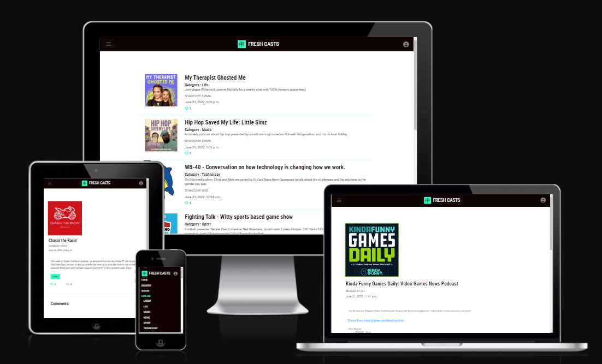
</p>

[Link to Website](https://fresh-casts.herokuapp.com/)

[GitHub Repo](https://github.com/RickofManc/fresh-casts)


***

## About

<br />

Fresh Casts is a website built for people who enjoy listening to podcasts, and would also like to share and discover new shows and series.
Through clear and intuitive design, Fresh Casts goal is to ensure the pleasure of listening, sharing and discussing podcasts is accessible to all possible user groups, no matter of age or background.

***
<br />

## Index - Table of Contents

* [User Experience R&D](#user-experience-research-and-design)
    * [Strategy](#strategy)
    * [Scope](#Scope)
    * [Structure](#Structure)
    * [Skeleton](#Skeleton)
    * [Surface](#Surface)
* [Data Model](#Data-Model) 
* [Features](#Features)
* [Testing](#Testing)
* [Deployment](#Deployment)
* [Credits](#Credit)

<br />

***
<br />

## User Experience Research and Design

<br />

### Problem Statement

It's difficult to find a website or app where you can share and discuss podcasts.
Listeners may feedback or rate a podcast within a listening app, however these apps generally do not allow listeners to post and discuss liked podcasts.
Podcast listenership continues to increase with over 2 million shows to choose from, and by nature humans are social, we like to converse.
There's an opportunity to help people share podcasts, making it easier to discuss and find shows that may have slipped under their radar.

<br />

### Objective

Develop and deploy a website that promotes the sharing and discussion of podcasts they are enjoying. 
All visitors will be able to listen to shared podcasts. Users who create a Fresh Casts profile will be able to comment and like shared shows, as well as posting their own favourites. The site will meet WCAG 2.1 AA standards, and will be thoroughly tested to ensure all user groups can access and enjoy content.

<br />

### Design Thinking

Following a Design Thinking process, I've identified four key personas to empathize with and define their requirements.


<details><summary><b>User Personas</b></summary>
  
</details><br />


This phase led to User Stories being drafted complete with Acceptance Criteria and initial Tasks for the development phase. User Stories have been added to GitHub [here](https://github.com/users/RickofManc/projects/4/views/2) and are being tracked through to completion. Due the deadline for MVP release some User Stories have been archived and will be assessed for the Product Backlog and the next release.


#### Strategic Opportunities

The chart below highlights the features roadmap assessed by importance versus viability/feasibility of development for the MVP (Minimal Viable Product). This analysis will ensure the features that will provide immediate user benefit will be development first.

<p align="center">
  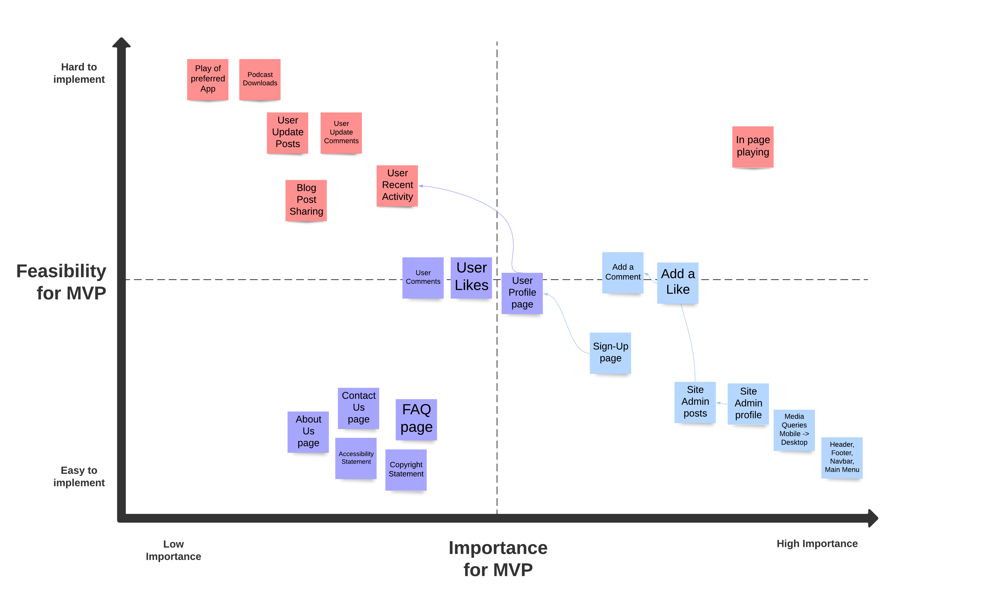
</p>

<br />

### Scope

An agile approach of keeping the in scope features simple and aligned to the strategy for the MVP will be adopted. Below is a list of the leading features for the Fresh Casts MVP.


#### In Scope Features
* Create an accessible website that follows convention for sites built to inform.
* Conventionally the site will have a fixed Header, Navbar and Footer.
* Main Menu will be accessible through a hamburger icon.
* By default, the homepage will show the latest posts in ascending order.
* A clickable link will enable Fresh Casters to find out more information on the post.
* Podcasts will be able ot click through to listen to shows in their host site.
* A user account will provide access to Commenting, Liking, Posting.
* Fresh Casters will be able to edit their own posts.
* A 'Contact Us' page will enable Fresh Casters to get in touch with Site Admin.
* An Accessibility Statement will inform of how Fresh Casts cares about accessibility.
* The site will be responsive across differing devices, from mobile first design through to large +2300px wide screens supported.


#### Out of Scope Features - for future release
* Search and learn - Using keywords, Fresh Casters will be able to search and hone in their choices.
* Recent activity - Compiling users activity data from across the site into their profile page.
* Podcast downloading - enabling Fresh Casters to listen offline.
* Preferred app - allowing Fresh Casters to listen to a podcast in their favourite listening app.
* Fresh Casters will be supported with a page dedicated to FAQ's.
* Single Sign On (SSO) - Use social apps such as Google, Facebook and Twitter to sign-in.
* Connecting Fresh Casters - Provide chat service to allow the community to interact directly.

<br />

### Structure

This website will be structured with the following design considerations.

* A Hub and Spoke structure, where the main content will be the homepage hub, and spokes are the pages to find out more information on a post. The spokes will also house useful pages such as Sign-up, Contact Us, About Us etc.
* Each post will be displayed in a shortened list view for the homepage with just enough information to entice the user. The post image and title will be clickable to open in a new page with full post details.
* Users wishing to add a comment or like will be asked to first create a user account. Once a brief form has been completed and submitted, users will have immediate access to all features. 
* Having a user account will allow users to interact with the site, adding comments, likes and being able to post their own content.
* All site visitors will be able to contact Fresh Casts through a contact form available from the Main Menu or Footer. 
* All pages will be available to users consistently through either the Main Menu or Footer - this should ensure users are never two clicks away from where they would like to be.


[Lucid Spark](https://lucidspark.com/) has been used to illustrate the Hub and Spoke structure for Fresh Casts website. Pages and features will be available from a single click from the Hub. The final structure for the MVP may differ slightly as development progresses, and from user feedback and testing.


<details>
    <summary><b>Site Structure</b></summary>
    <p align="center">
        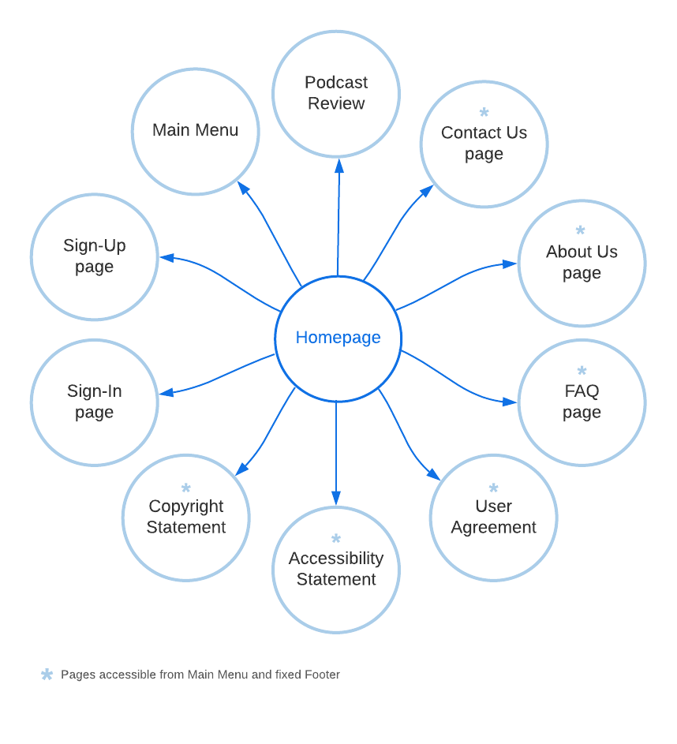
    </p>
</details><br />


### Skeleton

Key to the UX attributes is the speed and ease for which users can learn about new podcasts, or what fellow users think about a podcast. 

The 'Hub and Spoke' structure should provide users with content from their initial landing, and allowing their intrigue to click on a post and find out more, or refine the content by choosing one of five categories located conveniently in the NavBar Menu, Footer or by clicking a category within the posts listed on the homepage.

Aesthetically pages will be clean to promote the information, and allow users to flow between differing categories and expanding posts to learn more and add contribute. Convention from popular information based sites will be adopted so users feel at home and therefore capture their engagement within the first few seconds.


#### Wireframes

As part of this phase wireframes for mobile and desktop devices have been produced using [Balsamiq](https://balsamiq.com/wireframes/) (see image below - the wireframes are located within the project [Repo](wireframes)).

The website is responsive through differing screen widths being designed for mobile first to a max-width of 767px. Tablets are responsive from 768px through to 1023px, laptops from 1023-1440px, and desktops from 1440px upward. 

<details>
    <summary><b>Wireframes</b></summary>
    <p align="center">
        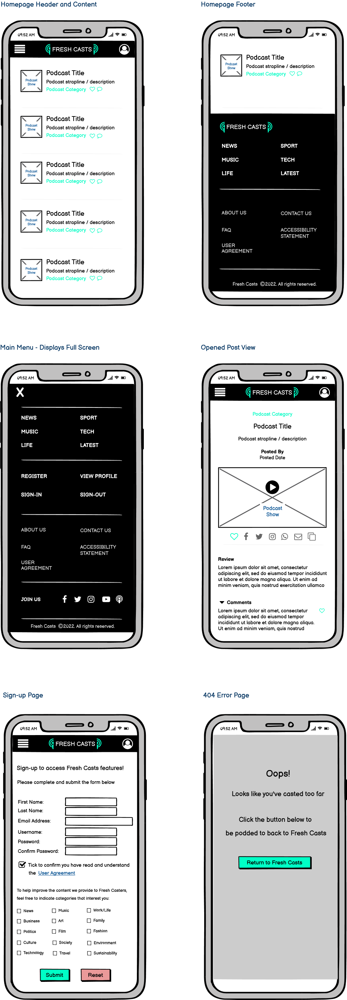
    </p>
</details><br />


### Surface 

In consideration that accessibility is a key design criteria, the visual language offers contrast using a simple colour palette, readable font and clear layout. Throughout the website this language has been applied consistently to promote intuitive behaviour with the most important links and information easily recognised.


#### Colour

This palette has been carefully selected to bring high contrasting colours to improve accessibility to visually impaired users. As the primary aim of the site is to inform, Black text on a White background is adopted throughout. The Teal based accents will be used to highlight buttons, points of reference or navigation and other key pieces of user information.

<details>
    <summary><b>Colour Palette</b></summary>
    <p align="center">
        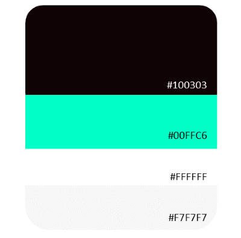
    </p>
</details>
<br />


#### Logo

The logo has been selected from [Adobe Stock](https://stock.adobe.com/uk/contributor/208909039/2arm?load_type=author&prev_url=detail&asset_id=430392467). The design by **2arm** is being used under a  paid license with Adobe Stock. The design appealed as for it's clean design that identifies key components of podcasting; a microphone, projecting sound and listeners typically through headphones. I have applied Fresh Casts colour theme to the Vector using the free app [Photopea](https://www.photopea.com/).

<p align="center">
    
</p>
<br />

#### Fonts

**Roboto Flex and Roboto Condensed**

I've selected this popular [font family](https://fonts.google.com/share?selection.family=Roboto%20Condensed:ital,wght@0,400;0,700;1,400;1,700%7CRoboto%20Flex:opsz,wght@8..144,100;8..144,300;8..144,400;8..144,500;8..144,600;8..144,700) for its clean lines and legibility, being widely used on news and information based websites. It also offers a condensed style which can be used for larger text headers to offer some contrast to body text.

<p align="center">
    
</p>
<br />

***

<br />

## Data Model

As part of the project planning phase a high-level design of the site [structure](#Structure) has been designed to understand the main entities, and the relationship between these entities set within a Hub and Spoke design.
This led to understanding the next level down through mapping out the tables, columns and attributes required for the database. The initial draft in Excel has been mapped into a data schema below using [draw.io](https://www.draw.io/index.html) to help understand how the entities and data will relate across the site.


In consideration of the a requirement for the data to be searchable, and in time understand patterns and trends in user behaviour, an Object-Relational Database using MVT architecture has been selected. I've opted for a PostgreSQL DBMS (Database Management System) as it can support the aforementioned requirements, PostgreSQL can also support multiple programming languages and libraries that which will be used to build the Fresh Casts application.

The diagram below shows the entity relationships between a blog post and their 'comments'. The Post Model is used by the Comment Model to ensure the right blog post is being commented on. The diagram also highlights that one blog post can have many comments. 

The key component in this relationship is the user. I have used the default Django User Model for ease, and whilst this is not declared in the models.py file, I have included within the diagram for clarity. 

Equally one user can add many likes throughout the site, however this functionality is built within the Post Model itself so has not been declared within this class level diagram. 

There are five categories created within the Django Admin panel. These are displayed to the user as a dropdown field choice when adding a blog post.

The diagram highlights the following relationships:
* One blog post can have one author (User)
* One blog post can have one category
* One blog post can have many comments
* One blog post can have many likes 
* One user can add one log post like
* One user can add many comments to one blog post

The Contact App data model does not yet have a relationship with the Blog App, however I have included for awareness towards future development.

 
<p align="center">
    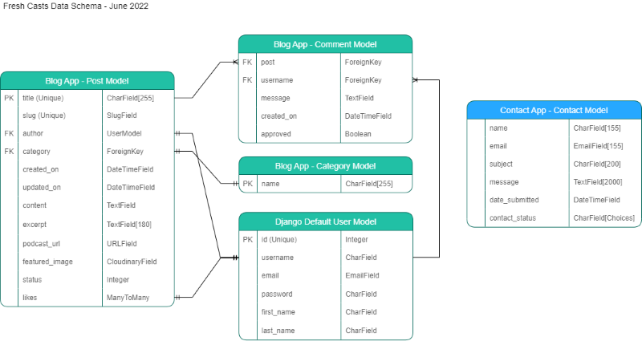
</p>
<br />


### Data Security

Specific steps have been taken to ensure the security of users data and the websites integrity. These are as follows;
* The use of an env.py file to store key variables for accessing secure environments i.e. Postgres Database.
* A gitignore file has been incorporated to ensure the env.py file is never committed to production. Therefore retaining the security of these key variables.
* Additionally, these variables are stored within the Config Variables in Heroku to ensure GitPod and Heroku can synchronise securely.
* Cross Site Request Forgery (CSRF) tokens have been applied to all HTML Forms. Their application provides protection from malicious attacks where users maybe performing certain actions or sending data when logged-in.
* Django's inbuilt User Authentication has been applied to several key areas to ensure only approved Users can Add, Comment, Like blog posts. A further layer of security has been applied to ensure the ability to Edit or Delete a blog post can only be performed by the User who has authored the blog post.


### Meta data

Meta data is included within the HTML head element to increase the traffic to the website. Additionally, site pages are titled appropriately as another method of informing users of their location.


***

<br />

## Technologies


### Languages

* HTML5
* CSS3
* Python
* Jquery

### Frameworks & Libraries

* [Django 3.2](https://docs.djangoproject.com/en/4.0/releases/3.2/) has been adopted as more preferable over the newest beta Django 4 to rapidly and securely develop this application.
* [dj_database_url](https://pypi.org/project/dj-database-url/) library used to allow Database urls to connect to the Postgres database.
* [Psycopg2](https://pypi.org/project/psycopg2/) supports the connection to the Postgres database.
* [Gunicorn](https://gunicorn.org/) was used as the Web Server to run Django on Heroku.
* [Django-allauth](https://django-allauth.readthedocs.io/en/latest/) used for addressing user authentication, registration and account management.
* [Bootstrap5](https://getbootstrap.com/docs/5.0/getting-started/introduction/) was used to build responsive web pages.
* [Summernote](https://summernote.org/) provides WYSIWYG editing of blog post descriptions on the admin side. An option was considered to allow users to edit the styles of their posts, however in practice this led to poor accessibility with differing font sizes and colours used.
* [Crispy Forms](https://django-crispy-forms.readthedocs.io/en/latest/) is simplifying rendering on several forms.
* [Cloudinary](https://cloudinary.com/products/programmable_media) has been used to store the images uploaded by users for their blog posts.


### Software & Web Applications

* [Balsamiq](https://balsamiq.com/) to build wireframes in the Skelton phase.
* [Lucid Spark](https://lucidspark.com/) for the high-level site structure.
* [draw.io](https://www.draw.io/index.html) to diagram data schema/model.
* [GitPod](https://gitpod.io/) used for the IDE and [GitHub](https://github.com/) as a hosting repository. In addition, for this project GitHub was used for the agile development aspect through the use of User Stories (GitHub Issues) and tracking them on a Kanban board.
* [Heroku](https://dashboard.heroku.com/) to host the Fresh Casts website, including database.
* [Wave](https://wave.webaim.org/) - Accessibility Testing to ensure content is readable for all users.
* [HTML Validator](https://validator.w3.org/) validates HMTL code.
* [W3 CSS Validator](https://jigsaw.w3.org/css-validator/validator) validates CSS code.
* [PEP8 Validator](http://pep8online.com/)  validates Python / Django code.
* [Code Beautify](https://codebeautify.org/) validates the code formatting for browser reading.
* [IE NetREnderer](https://netrenderer.com/index.php) for cross browser testing, specifically Microsoft IE versions 7-10.
* [LambdaTest](https://www.lambdatest.com/) for cross browser testing, specifically macOS Safari and Opera.


***

<br />

## Features


### Current Features

- __Homepage__
    
    All site visitors land with content visible. Blog posts are sorted in latest added date first and paginate with six per page.

<p align="center">
    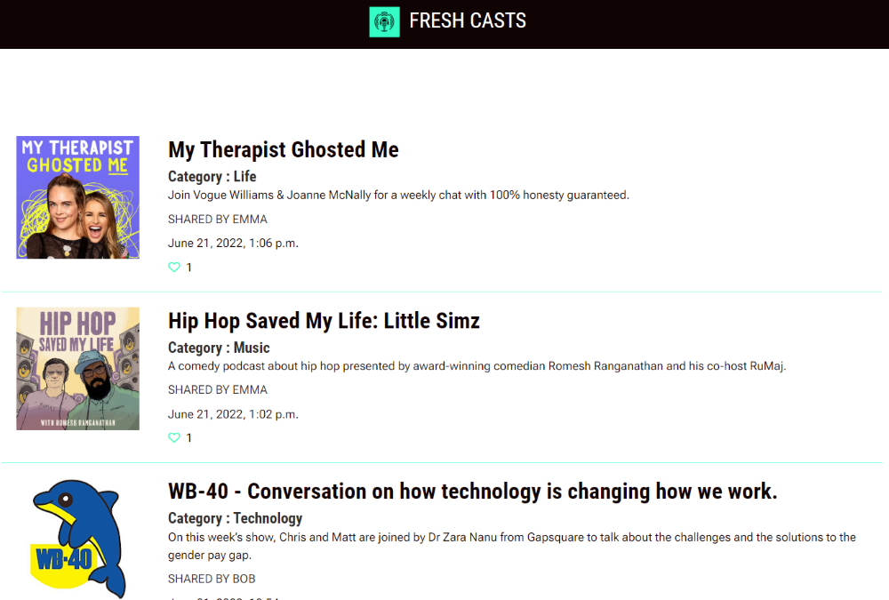
</p>
<br />


- __NavBar with Collapsing Menu__

    Utilising Bootstraps NavBar, users have three distinct sections to reach features.
    The left hand side uses the conventional hamburger menu icon to reveal a menu that offers access to user features, blog post categories and other useful pieces of information.
    Centrally the Fresh Casts name and logo takes a leading role to convey the brand as well as acting as a link back to the homepage.
    Whilst on the right hand side the resource profile icon provides a short menu with access to user features.
    The menu collapses either with a user choosing a menu item, by clicking the menu button or after a short time period.
    Features available to users within the menus depend on their login status e.g. if a user is logged in they will see options to Add Post and Edit Profile.

<p align="center">
    
</p>
<br />


- __Fixed Footer__

    Similar to the NavBar Main Menu, users have three distinct sections to reach features from the Footer.

<p align="center">
    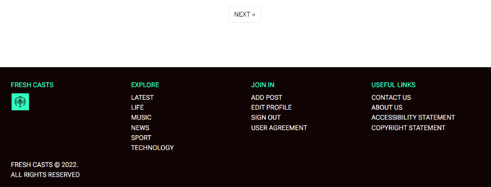
</p>
<br />


- __Create a Blog Post__

    Registered users have the ability to add to Fresh Casts content through creating a blog post. A simple form asks for basic details, including a link to the hosting URL. On form submission, users are informed the post will be reviewed by Site Admin and hopefully published if deemed appropriate within 24 hours.
    Users can also upload an image to support the post, if an image is not uploaded at the time, the Fresh Casts logo will be displayed. Users can update the post with an image once live. This feature currently works best on a desktop application, with a future feature using a podcast API to retrieve the URL and featured image automatically to the Form using search functionality.

<p align="center">
    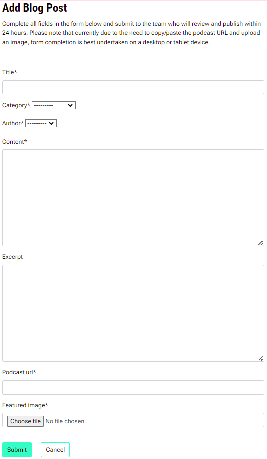
</p>
<br />


- __Read a Blog Post__

    When a user chooses a blog post from the main homepage list view or category page, they are taken through to a single page that displays all posted details and further features.
    All site visitors will be able to read about the shared podcast, and use the 'Listen' button to hear/see the show from the host site. Development work is going on to enable users to listen to the show within the site page.
    If users are registered and logged in they will be able to add a like or comment in the conventional manner, a counter provides an indication on how favoured a post is. If users have posted the item further options to Edit or Delete their post will be visible.

<p align="center">
    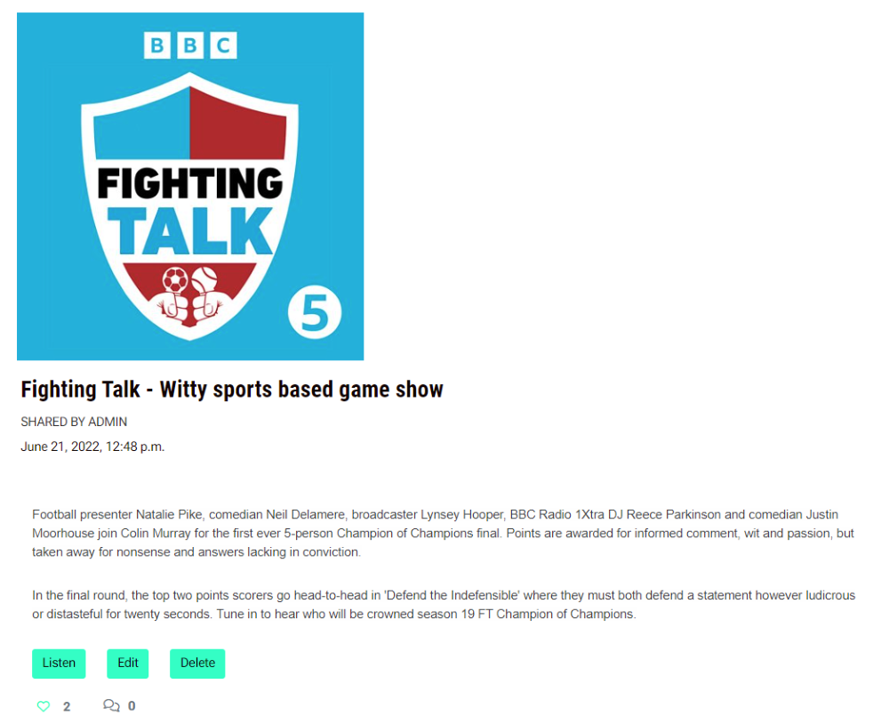
</p>
<br />


- __Commenting__

    A key feature for Fresh Casts is enabling the community to share their views with one another. All site visitors will be able to read a blog posts comments just below the main post content. Registered users will be able to add comments to kick start, or join in a conversation about a particular podcast.

<p align="center">
    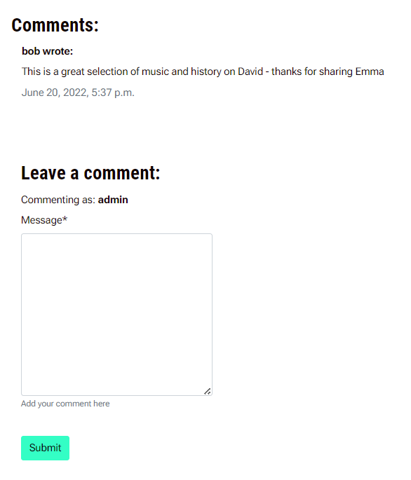
</p>
<br />


- __Update a Blog Post__

    Those users who have contributed by creating a blog post will have control over the content should they wish to make changes. This feature will only be visible to them on the Post in Detail page as an 'Edit' button. A simple form awaits with a Submit or Cancel button (should they have navigated there in error).

<p align="center">
    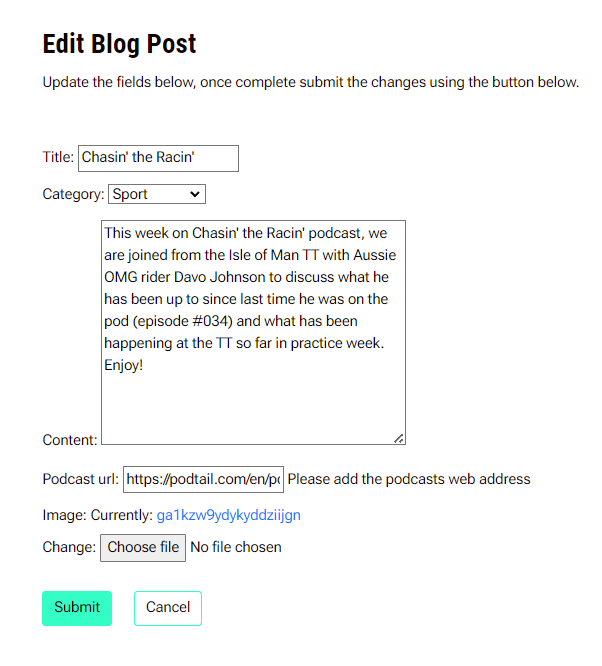
</p>
<br />


- __Delete a Blog Post__

    Those users who have contributed by creating a blog post will have control over whether to keep the post active or not. This feature will only be visible to them on the Post in Detail page as a 'Delete' button. The user will be asked on a new page to confirm they wish to remove the post in knowledge that it cannot be retrieved. There is a Cancel button (should they have navigated there in error).

<p align="center">
    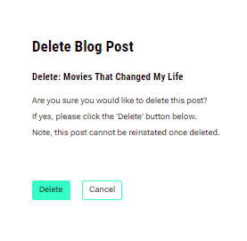
</p>
<br />


- __Update Profile__

    In addition to being able to update content they have posted, registered users will be able to update key account details i.e. Username, Email Address, First and Last Name. This option will only be visible in the Main Menus and Footer when a user is logged in. The next release will allow users to delete their profile. As a temporary solution, users can use the 'Contact Us' form to request this action.
    Passwords can also be updated - due to the sensitive and secure nature of this action, users wishing to update their password are taken through to another screen.

<p align="center">
    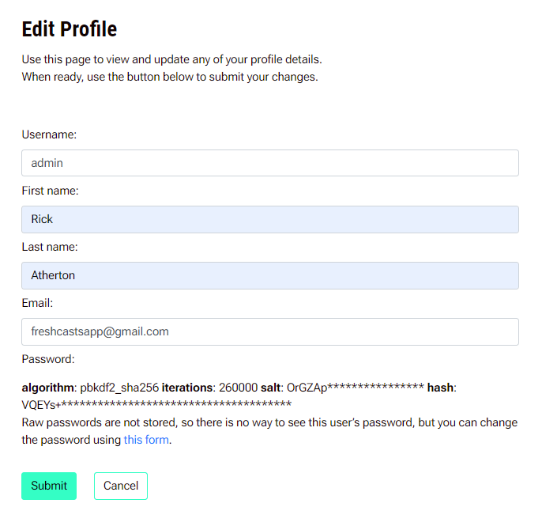
</p>
<br />


- __Contact Us__

    An essential feature is a method for Fresh Casters to contact the team. This can be performed with a direct email or by submitting a short form available from the Main Menu or Footer. The form requests some basic information and allows users to describe the reason for contact.
    Once received, the team can process the form in the backend and utilise a checkbox for status to mark when a response has been sent.

<p align="center">
    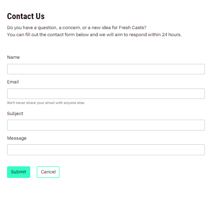
</p>
<br />


### Future Features

Features that will be added to the backlog for future releases are as follows:

* Search for blog posts through a search bar located in the NavBar. 
* Allow registered users to like other users comments.
* Enable registered users to delete their own posts.
* Provide an FAQ page to support users understanding and navigation of Fresh Cast features.
* Integrate a podcast API that will ease the adding of blog posts through automatically generated show images, URL's etc.
* Provide options for users to share blog posts on their socials.
* Enable site visitors to download a podcast to listen offline, or play in their preferred app.
* Allow registered users to update their own comments.
* Build a user profile page that informs of recent activity, posts viewed, likes and comments.
* Integrate a chat function that allows registered users to connect and discuss the post when listening at the same time, or just for general conversation.


***

<br />

## Testing 

<br />

### Manual Testing 

<br />

#### **Code**

The code on each file has been tested using the appropriate validation service; W3C Markup for HTML, W3C Jigsaw for CSS and Pep8 Online for Python.

As this project uses Django templates the html has been validated by manually clicking through the application pages, copying the templates to validate using the W3C Validator. HTML for the Django admin site pages was not edited so has not been validated here. The Signup, Login and Logout pages from Django allauth were customised and so have been validated. The same process was undertaken to test the Python files with Pep8 Online and CSS with W3C Jigsaw.

Due to the nature of extending the base.html template the W3C Validator consistently found the following warnings or errors. As these are incurred as part of the design they have not been listed within the table. Only exceptions not anticipated have been listed.
- Consider adding a lang attribute to the html start tag to declare the language of this document.
- Non-space characters found without seeing a doctype first. Expected <!DOCTYPE html>.
- Element head is missing a required instance of child element title. 
- Bad value  for attribute href on element a: Illegal character in path segment: { is not allowed.

Use the arrow below to view the results in detail.


<details>
    <summary></summary>
    <p align="center">
    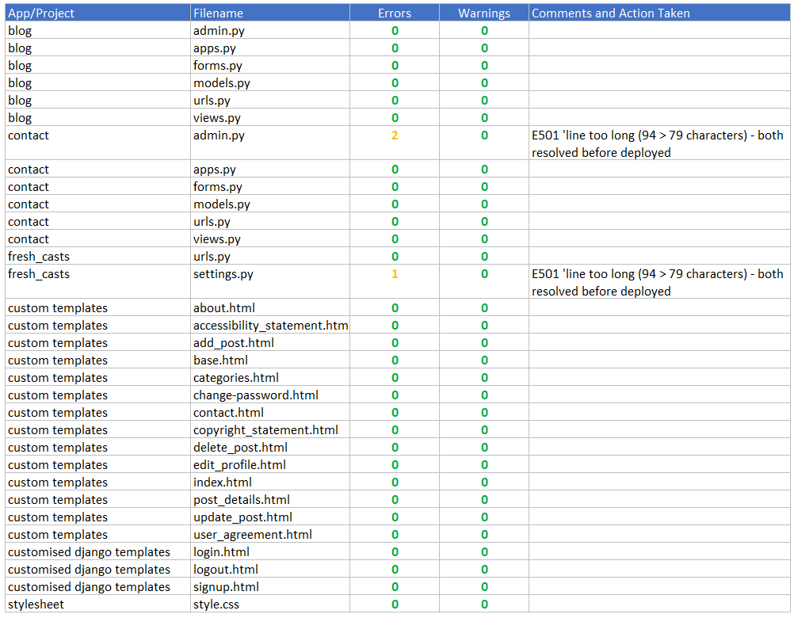
    </p>
</details>

<br />

#### **Browser**

To ensure site visitors can view and use Fresh Cast features on differing browsers, testing was performed on the test scenarios listed below.

To achieve a 'Pass' the following criteria had to be met across all website pages;
1. All buttons provide user feedback on hover and execute correctly when clicked
2. All colours load and displayed correctly
3. All elements retain integrity
4. Fonts and images load
5. Navigation is not impacted and nav-menu collapses as intended

<p align="center">
    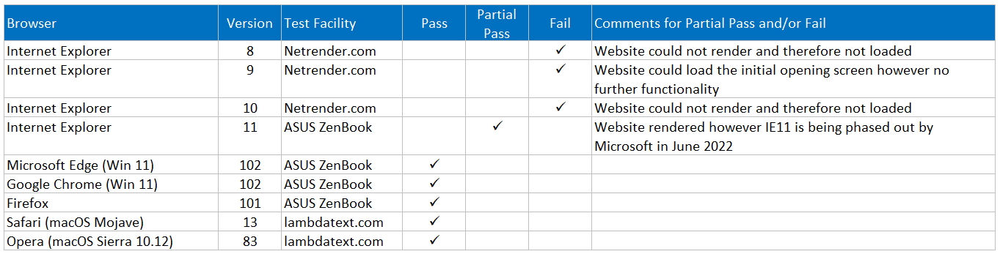
    </p>

<br />

#### **Device**

To ensure site visitors can view and use Fresh Cast on differing devices, testing was performed on the test scenarios listed below.
This physical testing is in addition to the continual device testing as part of UX development using Chrome Developer tools.
				
To achieve a 'Pass' the following criteria had to be met across all website pages;				
1. All buttons provide user feedback on hover and execute correctly when clicked				
2. All colours load and displayed correctly				
3. All elements retain integrity				
4. Fonts and images load				
5. Navigation is not impacted and nav-menu collapses as intended				

<p align="center">
    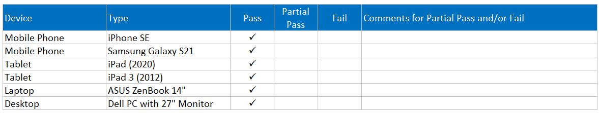
    </p>

<br />

#### **Accessibility**

The website has been thoroughly tested throughout all pages using the [Wave (Web Accessibility Evaluation Tool)](https://wave.webaim.org/). In general all pages performed well with 0 Errors identified.

A general theme was identified as Alerts where 'Adjacent links go to the same URL.' was noted. An example of this is within the 'Sign Up' page where a link is offered within the text to navigate to the 'Sign In' page if you already have an account. As the Nav-Menu and Footer offer the same link an Alert was raised. Consideration was given and where deemed necessary, workable links have been removed to avoid additional navigation and repetition for keyboard and screen reader users.


<p align="center">
    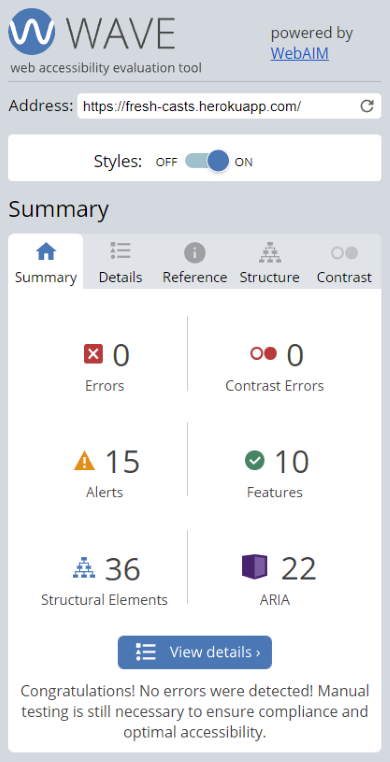
    </p>

<br />


#### **Lighthouse** 


Using Lighthouse testing within Chrome Developer Tools, the website has been tested for use on Desktop and Mobile devices. 
The website scored well across all criteria, however further work was required to;
- improve the contrast of the background to foreground for Accessibility,
- ensure there was sufficient spacing between Footer links for mobile users,
- transform all future images uploaded to webP format and 300x300px in size to improve page loading times.
Site wide research to improve Best Practices is required to add security where front-end JavaScript libraries are being used, in this case, jQuery as part of the Bootstrap use which scored a 3 for Vulnerability Count."																	
																	
Testing occurred using Lighthouse within Chrome Dev Tools on 4 July 2022 with the following results:


<p align="center">
    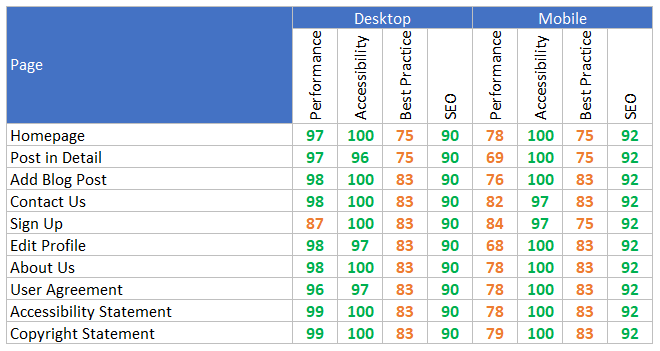
    </p>

<br />


#### **Feature**

Testing in Development and Production has been performed to ensure all the committed features for the MVP are working as designed. A table of results is available below.


<p align="center">
    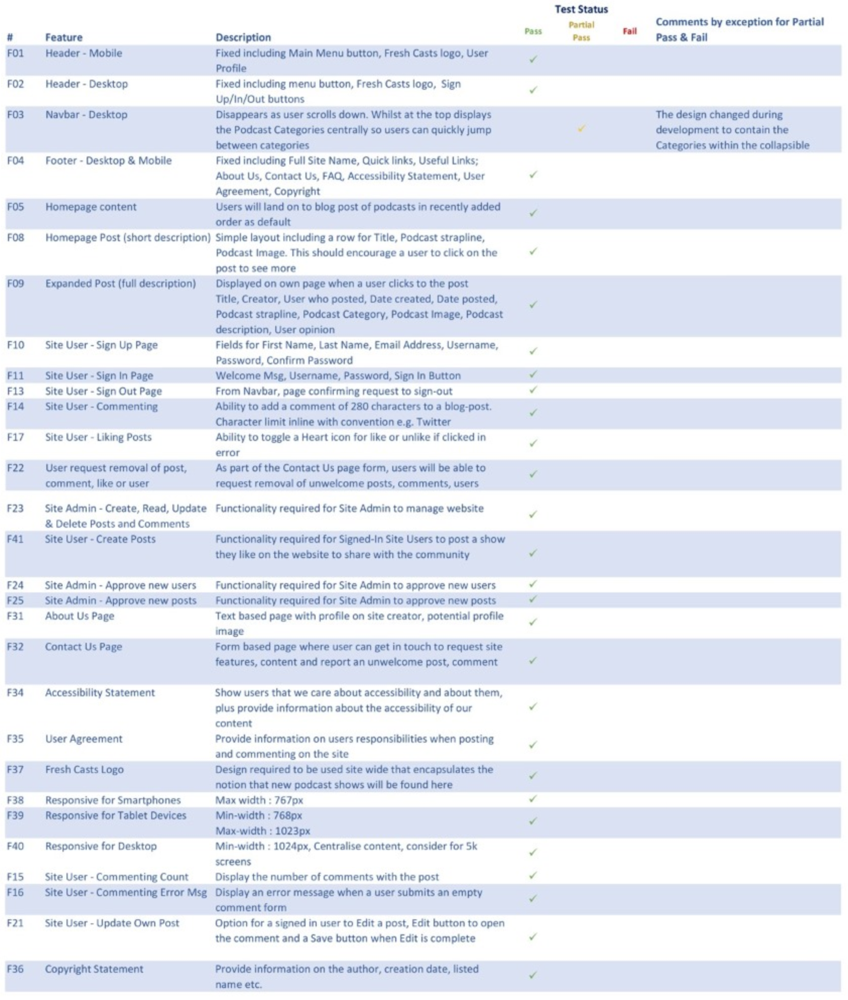
    </p>

<br />


### Automatic Testing

Django testing tools have been used to perform basic automated testing on Fresh Casts Python code, primarily for template rendering and some user functionality.

Tests were run using the local SQLite3 database as opposed to the production PostgreSQL database.

Test scripts were written for the following blog app files;

- models.py
- views.py
- forms.py
- admin.py

Whilst further testing is required to achieve 100%, the results thus far are highlighted in the summary report below:

<p align="center">
    
    </p>

<br />

### Bugs

The following bug does not impact the main purpose, functionality or features of Fresh Casts. However, at the time of writing further research was required in order to provide resolution. 


**B07 - Javascript URL redirect on input tag working but throwing error**
Input tag used to create functionality for a Cancel button. The JavaScript used to redirect the user back to the homepage is working correctly, however an error is being identified in the terminal.

```html
<div class="input-group"> <button class="btn btn-style right" type="submit">Submit </button> <input type="button" name="cancel" value="Cancel" class="anchor-btn btn-style btn-left-margin btn-cancel" onClick="window.location.href='';" /> </div>
```
Error:
';' expected.

<br />


***

<br />

## Deployment

This project was deployed using the steps below with version releasing active. Please do not make any changes to files within this repository as any changes pushed to the main branch will be automatically reflected on the live website. Instead, please follow the steps below which guide you to forking the website where changes can be made without impact to the live website. Thanks!


### Fork and Deploy Locally with GitHub

<details>
    <summary></summary>

To fork this website to either propose changes or to use as an idea for another website, follow these steps:
1. If you haven't yet, you should first set up Git. Don't forget to set up authentication to GitHub.com from Git as well.
1. Navigate to the [Fresh Casts](https://github.com/RickofManc/fresh-casts).
1. Click the 'Fork' button on the upper right part of the page. It's in between 'Watch' and 'Star'.
1. You will now have a fork of the Fresh Casts repository added to your GitHub profile. Navigate to your own profile and find the forked repository to add the required files.
1. Above the list of forked files click the 'Code' button.
1. A drop-down menu will appear providing a choice of cloning options. Select the one which is applicable to your setup.
</br>
Further details on completing the last step can be found on GitHub's [Fork a Repo](https://docs.github.com/en/get-started/quickstart/fork-a-repo) page

To deploy locally with GitHub, follow these steps:
1. Log into your GitHub repository, create a GitHub account if necessary
1. Click 'Settings' in the main Repository menu
1. Click 'Pages' from the left-hand side navigation menu
1. Within the Source section, click the "Branch" button and change from 'None' to 'Main'
1. The page should automatically refresh with a url displayed
1. Test the link by clicking on the url
1. From this point you can push code to this page using the following steps from with GitPod;
    1. With the application open, open the command line terminal (CLI)
    1. Stage any changes using the command 'git add .' or by specifying the file with changes i.e 'git add settings.py'
    1. Commit the changes to GitHub by adding a commit message describing the changes i.e. 'git commit -m "Update docbook dependency and generate epub"
    1. Finally add the command 'git push' which will push all the code to GitHub. You can view the deployed code using the url generated within the steps above.
    1. Additionally if you would like to run the application locally pre/post any changes, from the terminal type 'python3 manage.py runserver'.
    1. A dialog box should open asking you to open port 8000, click 'Open' and navigate to the opened tab/window which should allow you to view the running application.
    1. If the dialog box does not automatically appear, find the 'Remote Explorer' section of the left hand navbar within GitPod and click on the port '8000' and the internet/globe icon to the right which should open the running application.
</details>

### Deploy with Heroku

<details>
    <summary></summary>

1. Log in to Heroku at https://heroku.com - create an account if needed.
1. From the Heroku dashboard, click the Create new app button. For a new account an icon will be visible on screen to allow you to Create an app, otherwise a link to this function is located under the New dropdown menu at the top right of the screen.
1. On the Create New App page, enter a unique name for the application and select region. Then click Create app.
1. On the Application Configuration page for the new app, click on the Resources tab.
1. In the Add-ons search bar enter "Postgres" and select "Heroku Postgres" from the list - click the "Submit Order Form" button on the pop-up dialog.
1. Next, click on Settings on the Application Configuration page and click on the "Reveal Config Vars" button - check the DATABASE_URL has been automatically set up.
1. Add a new Config Var called DISABLE_COLLECTSTATIC and assign it a value of 1 - Remove this when releasing for Production.
1. Add a new Config Var called SECRET_KEY and assign it a value - any random string of letters, digits and symbols.
1. The settings.py file should be updated to use the DATABASE_URL and SECRET_KEY environment variable values as follows :

        DATABASES = {'default': dj_database_url.parse(os.environ.get('DATABASE_URL'))}

        SECRET_KEY = os.environ.get('SECRET_KEY')

1. In Gitpod, in the project terminal window, to initialize the data model in the postgres database, run the command : python3 manage.py migrate
1. Update the requirements.txt file with all necessary supporting files by entering the command : pip freeze > requirements.txt
1. Commit and push any local changes to GitHub.
1. In order to be able to run the application on localhost, add SECRET_KEY and DATABASE_URL and their values to env.py

Connect GitHub Repo to Heroku App

1. Navigate to Application Configuration page for the application on Heroku and click on the Deploy tab.
1. Select GitHub as the Deployment Method and if prompted, confirm that you want to connect to GitHub. Enter and search for the required repository, then click on Connect to link them up..
1. Scroll down the page and choose to either Automatically Deploy each time changes are pushed to GitHub, or Manually deploy - I chose the latter for the initial deployment to watch the build and then opted for Automatic Deployment.
1. The application can be run from the Application Configuration page by clicking on the Open App button.
1. Each time you push code from your GitHub Repo it will be automatically reflected in your Heroku App.

The url for this website can be found here https://freshcasts.herokuapp.com/
</details>


### Pre Production Deployment

<details>
    <summary></summary>

When you are ready to move to production, the following steps must be taken to ensure your site works correctly and is secure.

In GitPod:
1. Set DEBUG flag to False in settings.py
1. Check the following line exists in settings.py to enable Summernote to work on the deployed environment (CORS security feature): X_FRAME_OPTIONS = 'SAMEORIGIN'
1. Update the requirements.txt file with all necessary supporting files by entering the command : pip freeze > requirements.txt
1. Commit and push code to GitHub
In the Heroku App:
1. Settings > Config Vars : Delete environment variable : DISABLE_COLLECTSTATIC
1. Deploy : Click on deploy branch
</details>
    

***

<br />

## Credit


### Acknowledgements

* Mentor Brian Macharia for continuing to guide and feedback throughout the projects lifecycle, especially on how to improve UX and my code.


### Code

Support with how to develop ideas into code also came from various online resources:

* In general the coding and testing has relied on the Code Institutes walkthrough projects "Hello Django" and "I Think Therefore I Blog" as part of their Full Stack Frameworks module.
* [W3schools](https://www.w3schools.com/) as a source of 'How to...' information throughout the build primarily on Django.
* [Django Project Docs](https://docs.djangoproject.com/en/4.0/ref/models/fields/) were referenced many times, especially in how to reference fields correctly across differing py files.
* [Codemy](https://codemy.com/) provided insight on blog building in Django.
* [GeekforGeeks](https://www.geeksforgeeks.org/urlfield-django-models) for using dynamic URL fields in html tags.
* [Code Grepper](https://www.codegrepper.com/code-examples/whatever/bootstrap+card+with+image+on+left+and+text+on+right) guided me on how to align the post image to the left of text for the homepage list view.
* [Jordan Raychev at Medium](https://medium.com/geekculture/django-tutorial-building-a-portfolio-application-contact-application-ac128d7b7b89) who provided an article on building a Contact app.
* [Wolterskluwer](https://www.wolterskluwer.com/en/solutions/kluwerlawinternational/user-agreement) for information on Blog User Agreements.
* [John Harbison](http://johnharbison.net/make-a-form-a-cancel-button) provided guidance on creating a Cancel Button as an input tag within a Form.
* [Stack Overflow](https://stackoverflow.com/questions/10615872/bootstrap-align-input-with-button) how to align an Input tag as a button using Bootstrap.


