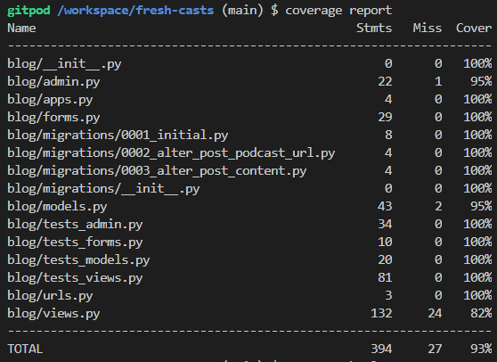

# Manual Testing

[Back to README](README.md)

Given I had failed the PP4 two times already, the purpose of my third and final attempt was to be as thorough as possible with the testing to give myself the best possible chance of passing the diploma. Using the level of detailed applied to CI's PP5, this file summarises the process, results, bugs and fixes as part of testing the Fresh Casts website.

Where a feature or functionality requires the support of multiple html files, for example the base.html supporting the index page, I have tested the homepage page in its entirety, as opposed to testing these files separately.

All tests were performed using the live environment deployed from Heroku.

 

## User Story Testing

The objective of this test is to validate that the user requirements have been delivered for those stories taken forward for the MVP release. Some were discounted as the project developed due to complexity to implement within the given time constraints.
Further details of Features, User Stories and the tasks can be found either in the [GitHub Projects Kanban Board](https://github.com/users/RickofManc/projects/4), or as features as an overview within the Design Thinking section of the [README](README.md).

 

| US Ref | GitPod Ref | User Story                                                                                                                                                                                       | Acceptance Criteria                                                                                                                                                                                                                                                                                                                                                                                                                                                                                                                                                                                                                                                                        | Result  | Rationale                                                                                                                                                                                                                                                                                                                |
| ------ | ---------- | ------------------------------------------------------------------------------------------------------------------------------------------------------------------------------------------------ | ------------------------------------------------------------------------------------------------------------------------------------------------------------------------------------------------------------------------------------------------------------------------------------------------------------------------------------------------------------------------------------------------------------------------------------------------------------------------------------------------------------------------------------------------------------------------------------------------------------------------------------------------------------------------------------------ | ------- | ------------------------------------------------------------------------------------------------------------------------------------------------------------------------------------------------------------------------------------------------------------------------------------------------------------------------ |
| US01   | [#1]         | As a Site User, I can understand what the site aim is and my options from viewing the homepage, so that I can intuitively navigate the site and enjoy the content                                | Acceptance Criteria 1: The site structure and layout should be clear and simple to navigate - all features within 1-2 clicks Acceptance Criteria 2: Site Users should be able to change the displayed posts by clicking on a category within the Main Menu Acceptance Criteria 3: Site Users will have an option to Sign Up, In or Out from the homepage                                                                                                                                                                                                                                                                                                                             | PASS    | Positive feedback from UAT evidenced that the sites aims are clear.                                                                                                                                                                                                                                                      |
| US02   | [#2]         | As a Site User, I can access the site on differing devices, so I can interact with content on my preferred device                                                                                | Acceptance Criteria 1: Successful tests for Responsiveness using Developer Tools Acceptance Criteria 2: Successful tests for Responsiveness through User Testing                                                                                                                                                                                                                                                                                                                                                                                                                                                                                                                        | PASS    | Testing complete for responsiveness on differing screen widths and devices. See specific tests results for further details.                                                                                                                                                                                              |
| US04   | [#4]         | As a Site User, I can view a list of posts, so that I can easily select a post to view                                                                                                           | Acceptance Criteria 1: By default the Homepage will displayed the most recent posts first Acceptance Criteria 2: A small card with the post title, strapline and image will be displayed Acceptance Criteria 3: Site Users will be able to click any part of the card to expand the post in another page Acceptance Criteria 4: Site Users will be able to return back to the Homepage results via a text link on the page, or by clicking the site logo with the Header (however this will reset the view)                                                                                                                                                                       | PASS    | Visitors are greeted with a list of podcasts to choose from, supported by an image and excerpt. Conventionally users can click on any part of the listing to find out more details about the post.                                                                                                                       |
| US05   | [#5]         | As a Site User, I have sufficient post details on the homepage, so that I can choose whether to click and find out more                                                                          | Acceptance Criteria 1: Successful user test resulting in users instinctively clicking on the cards to find out further information, and in a later release play a podcast                                                                                                                                                                                                                                                                                                                                                                                                                                                                                                                  | PASS    | See #4 rationale.                                                                                                                                                                                                                                                                                                        |
| US08   | [#8]         | As a Site User, I can register an account, so that I can comment and like posts                                                                                                                  | Acceptance Criteria 1: Site Users are provided with a simple Form to complete in order to register an account Acceptance Criteria 2: Form fields should follow convention for sign-up forms Acceptance Criteria 3: Form buttons should enable the Form to be submitted or cancelled Acceptance Criteria 4: Placeholders within Form fields will support Site Users with inputting the requested data                                                                                                                                                                                                                                                                              | PASS    | Any site user can register through navbar links to the form. Once the form is complete and submitted the user can login and start enjoying member features.                                                                                                                                                              |
| US09   | [#9]         | As a Site User, I can sign-in to my account, so that I can add comments and likes to posts                                                                                                       | Acceptance Criteria 1: Site Users will be able to sign-in from clicking a link in the Header, Main Menu or Footer Acceptance Criteria 2: Sites Users will be required to enter their Username and Password to activate their profile and Fresh Casts features Acceptance Criteria 3: A message should confirm to Site Users when they have successfully signed in Acceptance Criteria 4: A message should inform Site Users if the information entered was not valid, and to try again Acceptance Criteria 5: Site Users will be able to change profile information including their password                                                                                   | PASS    | Tested with differing users to ensure sign-in works, and that users can add/remove likes and posts, plus comment on any post. Passwords and other profile details can also be updated.                                                                                                                                   |
| US10   | [#10]        | As a Site User, I can be asked to confirm my request to sign-out, so that I can cancel if requested in error                                                                                     | Acceptance Criteria 1: Site Users will be able to sign-out from clicking a link in the Header, Main Menu or Footer Acceptance Criteria 2: Site Users will be asked to confirm they would like to proceed to sign-out Acceptance Criteria 3: If Site Users confirm they would like to sign-out they will lose access to features i.e. ability to post and comment                                                                                                                                                                                                                                                                                                                     | PASS    | Authenticated users can navigate to the sign-out feature from the navbar. This page acts as a check with the user to ensure they do wish to sign-out at this time.                                                                                                                                                       |
| US11   | [#11]        | As Site Admin, I can approve requests for new user accounts, so that I know the user agrees to the sites terms and conditions of use                                                             | Acceptance Criteria 1: Site Admin will receive an email requesting them to approve a new user account Acceptance Criteria 2: The email will request Site Admin signs-in to the Admin portal to view the submitted form details Acceptance Criteria 3: Site Admin will be presented with two buttons; Approve or Deny                                                                                                                                                                                                                                                                                                                                                                 | REMOVED | Further consideration given to not include this feature in order to improve the user journey. Convention with other sites does not have an approval process as this delays the user being actively involved with the website. Therefore this feature has been removed.                                             |
| US12   | [#12]        | As a Site User, I can 'like' a post, so that I can provide positive feedback to the blogger                                                                                                      | Acceptance Criteria 1: A Site User that has signed in to their account will be able to click a Heart icon within a post to inform the blogger of they like the post Acceptance Criteria 2: If the icon has been clicked in error, Site Users should be able to deselect the icon to remove the like Acceptance Criteria 3: Site Users should only be able to deselect a Like where they have initially added one                                                                                                                                                                                                                                                                     | PASS    | Authenticated users can add a like to any post by clicking the heart icon. Feedback through Django messaging thanks the user for providing feedback. A second click on the heart removes the like.                                                                                                                       |
| US13   | [#13]        | As a Site User, I can add comments to a post, so that I can provide feedback and/or start a discussion                                                                                           | Acceptance Criteria 1: A Site User that has signed in to their account will be able to add a comment to a post, providing their opinion on the shared post Acceptance Criteria 2: A button clearly stating to 'Submit' their comment will be available next to the open text box Acceptance Criteria 3: User will be informed the comment will be reviewed and approved in due course                                                                                                                                                                                                                                                                                                | PASS    | Authenticated users can add a comment to a post. A message thanks the user for commenting and commits to their message being reviewed and published within 24 hours. This control is in place to prevent any comments which other users may find offensive being published.                                              |
| US14   | [#14](https://github.com/RickofManc/fresh-casts/issues/14)        | As a Site User, I can 'like' another users comment, so that I can provide feedback to the commenter                                                                                              | Acceptance Criteria 1: A Site User that has signed in to their account will be able to click a Heart icon next to a comment to inform the Commenter they like their comment Acceptance Criteria 2: If the icon has been clicked in error, Site Users should be able to deselect the icon to remove the like Acceptance Criteria 3: Site Users should only be able to deselect a Like where they have initially added one                                                                                                                                                                                                                                                             | FAIL    | Due to time constraints to reach the MVP date this feature will be delayed to the next release.                                                                                                                                                                                                                          |
| US15   | [#15](https://github.com/RickofManc/fresh-casts/issues/15)        | As a Site User, I can listen to the posted show on the site, so that I don't have to find again in my podcast app                                                                                | Acceptance Criteria 1: After clicking a post from the homepage, Site Users will be redirected to a page that provides more information on the podcast. Included with this will be a link to play the podcast from the page Acceptance Criteria 2: Site Users will be able to start/pause/stop the podcast, and the change the volume                                                                                                                                                                                                                                                                                                                                                    | FAIL    | Due to time constraints to reach the MVP date this feature will be delayed to the next release.                                                                                                                                                                                                                          |
| US16   | [#16]        | As a Site User, I can create a post, so that I can share shows I like with others                                                                                                             | Acceptance Criteria 1: A Site User that has signed into their account will have the option to share a podcast they like through creating a post Acceptance Criteria 2: An option within the Main Menu or User Account page will redirect Sites Users to a page displaying a Form Acceptance Criteria 3: Site Users will be asked to complete the Form that will come with placeholder information to support the data entry Acceptance Criteria 4: On submitting the Form, Site Admin will be asked to approve the post before publishing it on the site                                                                                                                          | PASS    | Authenticated users can add their posts through completing a form which is accessible through the navbar. A message thanks the users for submitting a post and commits to reviewing and publishing within 24 hours.  This control is in place to prevent any posts which other users may find offensive being published. |
| US17   | [#17]        | As Site Admin, I can approve new posts from Site Users, so that I can manage site content                                                                                                        | Acceptance Criteria 1: Site Admin will receive an email requesting them to approve a new post Acceptance Criteria 2: The email will request Site Admin signs-in to the Admin portal to view the draft and publish the post                                                                                                                                                                                                                                                                                                                                                                                                                                                              | PASS    | This has partially passes as Site Admins can approve posts (and comments) from the Django Admin Panel, however they do not currently receive a notification email when a post (or comment) is submitted. A future release will see this enabled as well as front end management of posts (and comments).                 |
| US18   | [#18]        | As a Site User, I can contact Site Admin, so I can request site features, post deletion and report offensive posts, comments or users                                                            | Acceptance Criteria 1: As part of the Contact Us page form, users will be able to request removal of offensive posts, comments, users                                                                                                                                                                                                                                                                                                                                                                                                                                                                                                                                                      | REMOVED | Users can request as part of the 'Contact Us' form which is available to all site visitors.                                                                                                                                                                                                                              |
| US19   | [#19]        | As Site Owner, I would like to provide Site Users with more information on the sites creation, so that Site Users can understand the aims and potentially contribute to ideas and development    | Acceptance Criteria 1: Site Users will be able to access this page from either the Main Menu or Footer Acceptance Criteria 2: Site Users will be navigated to a new page which informs of who, when, why and what Fresh Casts is about Acceptance Criteria 3: Site Users should intuitively return back to the homepage from either clicking the logo in the Header or from a text link on the page Acceptance Criteria 4: Site Users will be offered an opportunity to register an account following understanding more about Fresh Casts                                                                                                                                        | PASS    | Any site user can learn this information either from the 'About Us' link within the navbar menu or the footer.                                                                                                                                                                                                           |
| US20   | [#20]        | As Site Owner, I can provide a contact form for Site Users, so they can provide feedback, request features, report offensive posts, comments, user or to request the deletion of their own posts | Acceptance Criteria 1: Site Users will be able to access this page from either the Main Menu or Footer Acceptance Criteria 2: Site Users will be introduced to the FAQ page in case they hadn't already viewed this information and could of had their question answered Acceptance Criteria 3: Site Users will be provided with a Form to complete, learning where the Form is sent and when to expect a response Acceptance Criteria 4: Site Users should intuitively return back to the homepage from either clicking the logo in the Header or from a text link on the page Acceptance Criteria 5: Site Users will receive an email confirming the Form has been submitted | PASS    | Not done:  Notify Site Admin when a Form has been submitted  Send confirmation to Site User of the Form being submitted                                                                                                                                                                                               |
| US21   | [#21](https://github.com/RickofManc/fresh-casts/issues/21)        | As a Site User, I can find answers to general questions, so that I don't have to wait for a response from the Site Owner                                                                         | Acceptance Criteria 1: Site Users most popular questions can be answered in a single page that is conveniently accessed from the Main Menu or Footer Acceptance Criteria 2: Site Users will be provided with a link to contact Site Admin if a question cannot be answered                                                                                                                                                                                                                                                                                                                                                                                                              | FAIL    | Due to time constraints to reach the MVP date this feature will be delayed to the next release.                                                                                                                                                                                                                          |
| US22   | [#22](https://github.com/RickofManc/fresh-casts/issues/22)        | As a Site User, I can play a podcast in my preferred app, so that I can save and subscribe if liked                                                                                              | Acceptance Criteria 1: Site Users will be able to identify their preferred listening app from an icon on the post page Acceptance Criteria 2: Clicking the icon will open the app on their device and play that podcast show                                                                                                                                                                                                                                                                                                                                                                                                                                                            | FAIL    | Due to time constraints to reach the MVP date this feature will be delayed to the next release.                                                                                                                                                                                                                          |
| US23   | [#23]        | As a Site User, I can find out how the Site Owner has made content accessible, so that I can interact as designed                                                                                | Acceptance Criteria 1: Site Users will be able to learn how Fresh Casts care about accessibility and about them, plus provide information about the accessibility of our content Acceptance Criteria 2: Clicking the Main Menu or Footer link will navigate Site Users to a page that displays the Accessibility statement                                                                                                                                                                                                                                                                                                                                                              | PASS    | Any site user can learn this information either from the 'Accessibility Statement' link within the navbar menu or the footer.                                                                                                                                                                                            |
| US24   | [#24]        | As a Site User, I can learn the responsibilities for site use, so that I can act responsibly                                                                                                     | Acceptance Criteria 1: Site Users will be able to learn how Fresh Casts asks them to act whilst posting and commenting on the site, and also the responsibilities of Site Admin with complaints Acceptance Criteria 2: Clicking the Main Menu or Footer link will navigate Site Users to a page that displays the User Agreement                                                                                                                                                                                                                                                                                                                                                        | PASS    | Any site user can learn this information either from the 'Copyright Statement' link within the navbar menu or the footer.                                                                                                                                                                                                |
| US25   | [#25]        | As a Site User, I can learn about the Copyright aspects of this site, so that I do not infringe on copyright rules                                                                               | Acceptance Criteria 1: Site Users will be able to learn about the Copyright use for Fresh Casts by clicking on a link within the Main Menu and Footer Acceptance Criteria 2: Clicking the link will navigate Site Users to a page that displays the Copyright statement                                                                                                                                                                                                                                                                                                                                                                                                                 | PASS    | Any site user can learn this information either from a link within the navbar menu or the footer.                                                                                                                                                                                                                        |
| US26   | [#26](https://github.com/RickofManc/fresh-casts/issues/26)        | As a Site User, I can download a podcast from the site, so I can listen whilst offline                                                                                                           | Acceptance Criteria 1: Site Users should have an option to download a podcast to listen offline at the users convenience e.g. if travelling by plane Acceptance Criteria 2: Option should be in a clickable link (text/icon) Acceptance Criteria 3: Option should be available for PC, iOS, Android users                                                                                                                                                                                                                                                                                                                                                                            | FAIL    | Due to time constraints to reach the MVP date this feature will be delayed to the next release.                                                                                                                                                                                                                          |
| US27   | [#27](https://github.com/RickofManc/fresh-casts/issues/27)        | As a Site User, I can share a podcast/post with friends and family, so they can enjoy or learn something new                                                                                     | Acceptance Criteria 1: Through clicking the social media icons within a post, Site Users will navigate to the desired app to share within their network Acceptance Criteria 2: User research indicated the feature offered by YouTube is intuitive to use                                                                                                                                                                                                                                                                                                                                                                                                                               | FAIL    | Due to time constraints to reach the MVP date this feature will be delayed to the next release.                                                                                                                                                                                                                          |
| US28   | [#28]        | As Site Owner, I want a Fresh Casts logo, so Site Users can identify with the site                                                                                                               | Acceptance Criteria 1: A logo that is identifiable as relating to podcasts that can help build the brand Acceptance Criteria 2: Logo to be used within the Header and any external comms i.e. email service                                                                                                                                                                                                                                                                                                                                                                                                                                                                             | PASS    | A logo has been incorporated to the site as part of the navbar and favicon. The icon reflects a microphone and soundwaves to help inform visitors of the sites aims.                                                                                                                                                     |
| US29   | [#29]        | As a Site User, I can see the number of comments a post has received, so that I can gauge whether it would be a good conversation to join or have pertinent points raised                        | Acceptance Criteria 1: At a glance Site Users will be able to learn how many comments have been submitted against a post from either the short homepage or full description                                                                                                                                                                                                                                                                                                                                                                                                                                                                                                                | PASS    | A count is located next to the like 'heart' icon both in the list view and main post detail view.                                                                                                                                                                                                                        |
| US30   | [#30]        | As a Site User, I am notified if I try to submit a blank comment, so that I have the opportunity to correct before submitting                                                                    | Acceptance Criteria 1: A friendly message displayed to the Site User kindly informing that the comment text field remains empty so their comment cannot be submitted                                                                                                                                                                                                                                                                                                                                                                                                                                                                                                                       | PASS    | In built feature within the Django App performs this functionality so no requirement to overwrite/duplicate.                                                                                                                                                                                                             |
| US31   | [#31]        | As a Site User, I can update my own posts, so that I can manage my content                                                                                                                       | Acceptance Criteria 1: Site user who created the post can update, submit the changes and see the changes immediately                                                                                                                                                                                                                                                                                                                                                                                                                                                                                                                                                                       | PASS    | Authenticated users that have had a post published can edit all details of there post with the exception of the title due to a bug where if this field is updated a new record is created. See issue ref [#61] for further details.                                                                                        |
| US32   | [#32](https://github.com/RickofManc/fresh-casts/issues/32)        | As a Site User, I can update my own comments, so that I can manage my content                                                                                                                    | Acceptance Criteria 1: A signed-in Site User will have an clickable link next to their comments to 'Edit'. When clicked the comment text box will open with the Site User being able to Edit Acceptance Criteria 2: A 'Save' button/link will be displayed when the text box is open that can be clicked once the Site User has finished making updates                                                                                                                                                                                                                                                                                                                                 | FAIL    | Due to time constraints to reach the MVP date this feature will be delayed to the next release.                                                                                                                                                                                                                          |
| US33   | [#33]        | As a Site User, I can sign-in to my account using one of my social media accounts, so a step is removed before being able to use Fresh Casts features                                         | Acceptance Criteria 1: Successful tests that SSO works for Site Users using Google, Facebook, Twitter                                                                                                                                                                                                                                                                                                                                                                                                                                                                                                                                                                                      | FAIL    | Due to time constraints to reach the MVP date this feature will be delayed to the next release.                                                                                                                                                                                                                          |
| US35   | [#35](https://github.com/RickofManc/fresh-casts/issues/35)        | As a Site User, I can view my recent activity, so that I can learn behaviour traits i.e. which podcast categories I like most, where I have posted comments etc.                                 | Acceptance Criteria 1: Site Users profile page has an additional section that provides an overview of recent activity                                                                                                                                                                                                                                                                                                                                                                                                                                                                                                                                                                      | FAIL    | Due to time constraints to reach the MVP date this feature will be delayed to the next release.                                                                                                                                                                                                                          |
| US36   | [#36](https://github.com/RickofManc/fresh-casts/issues/36)        | As a Site User, I can connect with other Site Users through a forum/chat function, so that I can discuss podcasts further                                                                        | Acceptance Criteria 1: An initial option could be with consent, share a Users Email Address for connecting outside Fresh Casts Acceptance Criteria 2: A chat feature within the site, could be invoked by clicking on another Site User who has consented to be open to connecting                                                                                                                                                                                                                                                                                                                                                                                                      | FAIL    | Due to time constraints to reach the MVP date this feature will be delayed to the next release.                                                                                                                                                                                                                          |
| US07   | [#7](https://github.com/RickofManc/fresh-casts/issues/7)         | As a Site User, I can search for content by entering descriptive words, so that I can filter the content to my liking                                                                            | Acceptance Criteria 1: Search functionality is accessible to Site Users on the desktop Homepage Acceptance Criteria 2: Search functionality is accessible to Site Users within the Main Menu to aid mobile users                                                                                                                                                                                                                                                                                                                                                                                                                                                                        | FAIL    | Due to time constraints to reach the MVP date this feature will be delayed to the next release.                                                                                                                                                                                                                          |

 

## Page Validation

This test aims to check all features and links from across the site are working as designed and developed.

To perform the test I used a Chrome browser, and validated each page from a mobile and desktop perspective.

Testing identified one fail in that a new record was created when a user updated the post title. This was due to the title field being declared as the primary key within the data schema and as such when it is updated Django views this as a new record in the database. To modify this field by removing the primary key and allowing the default django ID to be used, would require the data schema to be updated and the SQL DB dumped. At this point in the project I decided to avoid having to lose users data whilst I research how to reload the data cleanly following an update to the data schema. As a suitable temporary solution, I have prevented updates to the title field. All other field updates are working as required.

 

| File path                                                               | File Type | Features working | Links active |
| ----------------------------------------------------------------------- | --------- | ---------------- | ------------ |
| templates/account/login.html                                            | HTML      | PASS             | PASS         |
| templates/account/logout.html                                           | HTML      | PASS             | PASS         |
| templates/404.html                                                      | HTML      | PASS             | PASS         |
| templates/500.html                                                      | HTML      | PASS             | PASS         |
| templates/about.html                                                    | HTML      | PASS             | PASS         |
| templates/accessibility_statement.html                                  | HTML      | PASS             | PASS         |
| templates/add_post.html                                                 | HTML      | PASS             | PASS         |
| templates/categories.html                                               | HTML      | PASS             | PASS         |
| templates/change-password.html                                          | HTML      | PASS             | PASS         |
| templates/contact.html                                                  | HTML      | PASS             | PASS         |
| templates/copyright_statement.html                                      | HTML      | PASS             | PASS         |
| templates/delete_post.html                                              | HTML      | PASS             | PASS         |
| templates/edit_profile.html                                             | HTML      | PASS             | PASS         |
| [https://fresh-casts.herokuapp.com](https://fresh-casts.herokuapp.com/) | HTML      | PASS             | PASS         |
| templates/post_detail.html                                              | HTML      | PASS             | PASS         |
| templates/sign_up.html                                                  | HTML      | PASS             | PASS         |
| templates/update_post.html                                              | HTML      | FAIL             | PASS         |
| templates/user_agreement.html                                           | HTML      | PASS             | PASS         |

 

## Responsiveness

To test the websites layout and content remains well structured and accessible across differing screen sizes, I used Chrome's Developer Tools to virtualise how the website and all its pages look and feel. In consideration that I opted to use Bootstrap which provides standard media queries for screen sizes from XS through to XL, I selected the following screens to test on; iPhone 4, iPhone SE, Samsung Galaxy S8, iPad, iPad Pro, Laptop at 1366x768, Monitor at 1920x1080 and iMac 5K.

Testing identified one fail when testing on an iPhone where the post text was located under the image and not to the right as per the category view. Furthermore some of the posts started slightly off the screen to the left. Resolution was to compare the homepage with the category view and remove unnecessary padding from the cards, whilst maintaining an min-width image size when required at +992px screen width.

  

| File path                                                               | Mobile | Tablet | Desktop |
| ----------------------------------------------------------------------- | ------ | ------ | ------- |
| templates/account/login.html                                            | PASS   | PASS   | PASS    |
| templates/account/logout.html                                           | PASS   | PASS   | PASS    |
| templates/404.html                                                      | PASS   | PASS   | PASS    |
| templates/500.html                                                      | PASS   | PASS   | PASS    |
| templates/about.html                                                    | PASS   | PASS   | PASS    |
| templates/accessibility_statement.html                                  | PASS   | PASS   | PASS    |
| templates/add_post.html                                                 | PASS   | PASS   | PASS    |
| templates/categories.html                                               | PASS   | PASS   | PASS    |
| templates/change-password.html                                          | PASS   | PASS   | PASS    |
| templates/contact.html                                                  | PASS   | PASS   | PASS    |
| templates/copyright_statement.html                                      | PASS   | PASS   | PASS    |
| templates/delete_post.html                                              | PASS   | PASS   | PASS    |
| templates/edit_profile.html                                             | PASS   | PASS   | PASS    |
| [https://fresh-casts.herokuapp.com](https://fresh-casts.herokuapp.com/) | FAIL   | PASS   | PASS    |
| templates/post_detail.html                                              | PASS   | PASS   | PASS    |
| templates/sign_up.html                                                  | PASS   | PASS   | PASS    |
| templates/update_post.html                                              | PASS   | PASS   | PASS    |
| templates/user_agreement.html                                           | PASS   | PASS   | PASS    |

 

## Accessibility 

Key to any successful website is ensuring its accessibility. As well as using Chrome's Developer Tools to test each html page, I also used the [WAVE online assessment tool](https://wave.webaim.org/) as I feel this provides a deeper level of insight and is clearer in highlighting where improvements are required.
To achieve a pass, each page had to have 0 Errors and 0 Contrast Errors from WAVE, or +90% from Chrome's Developer Tools.

Summary of the results;
* When using WAVE, it was not possible to run a test on the pages where authentication was required; add_post.html, delete_post.html, edit_profile.html and update_post.html. In this scenario Chrome's Developer Tools helped in providing the assessment.
* The test highlight multiple links to the same page. This was prevalent on the homepage where there was a link to categories in the navbar drop-down menu, and another within the post details in the homepage page list view. To improve the experience for users with screen readers I opted to remove the category name and link from each post, and instead allow users to navigate using the navbar menu only.

 

| File path                                                               | Result |
| ----------------------------------------------------------------------- | --------- |
| templates/account/login.html                                            | PASS      |
| templates/account/logout.html                                           | PASS      |
| templates/404.html                                                      | PASS      |
| templates/500.html                                                      | PASS      |
| templates/about.html                                                    | PASS      |
| templates/accessibility\_statement.html                                 | PASS      |
| templates/add\_post.html                                                | NP        |
| templates/categories.html                                               | PASS      |
| templates/change-password.html                                          | PASS      |
| templates/contact.html                                                  | PASS      |
| templates/copyright\_statement.html                                     | PASS      |
| templates/delete\_post.html                                             | NP        |
| templates/edit\_profile.html                                            | NP        |
| [https://fresh-casts.herokuapp.com](https://fresh-casts.herokuapp.com/) | PASS      |
| templates/post\_detail.html                                             | PASS      |
| templates/sign\_up.html                                                 | PASS      |
| templates/update\_post.html                                             | NP        |
| templates/user\_agreement.html                                          | PASS      |

 

 
## Performance

All pages were tested using Chrome's developer tool 'Lighthouse Testing'. At a high-level the tool tests performance in terms of loading speed, best-practice in regards to layout, SEO for how searchable the website and how accessible it is for visually impaired users who may also require a screen reader. Despite trying I could not test the 404 and 500 error pages and so they have been discounted from the results below.

To try and achieve clear and consistent results I used an incognito version of Chrome. 

The website scored well across all criteria, however further work was required to;
- improve the contrast of the background to foreground for Accessibility,
- ensure there was sufficient spacing between Footer links for mobile users,
- transform all future images uploaded to webP format and 300x300px in size to improve page loading times.

Research is required to improve an average Best Practices score of 83. The issue raised relates to the use of front-end JavaScript libraries with known security vulnerabilities. Three medium severity counts have been identified against the use of JQuery version 3.3.1 from Jan 2018. A fix is likely to be upgrading to a newer version of the library where a fix has been applied. However I need to ensure a newer version will be compatible with the version of Bootstrap I've implemented.

																	
The results below show mobile in the first 4 columns and desktop in the second 4 columns.

 

| File path                                                               | Performance | Accessibility | Best Practice | SEO | Performance | Accessibility | Best Practice | SEO |
| ----------------------------------------------------------------------- | ----------- | ------------- | ------------- | --- | ----------- | ------------- | ------------- | --- |
| templates/account/login.html                                            | 96          | 100           | 83            | 92  | 100         | 100           | 83            | 90  |
| templates/account/logout.html                                           | 91          | 100           | 83            | 92  | 100         | 100           | 83            | 90  |
| templates/about.html                                                    | 93          | 100           | 83            | 92  | 98          | 100           | 83            | 90  |
| templates/accessibility\_statement.html                                 | 96          | 100           | 83            | 92  | 99          | 100           | 83            | 90  |
| templates/add\_post.html                                                | 53          | 100           | 83            | 92  | 98          | 100           | 83            | 90  |
| templates/categories.html                                               | 77          | 100           | 83            | 92  | 98          | 100           | 83            | 90  |
| templates/change-password.html                                          | 92          | 100           | 83            | 92  | 99          | 100           | 83            | 90  |
| templates/contact.html                                                  | 85          | 100           | 83            | 92  | 99          | 100           | 83            | 90  |
| templates/copyright\_statement.html                                     | 96          | 100           | 83            | 92  | 98          | 100           | 83            | 90  |
| templates/delete\_post.html                                             | 83          | 100           | 83            | 92  | 100         | 100           | 83            | 90  |
| templates/edit\_profile.html                                            | 94          | 97            | 83            | 92  | 99          | 97            | 83            | 90  |
| [https://fresh-casts.herokuapp.com](https://fresh-casts.herokuapp.com/) | 72          | 100           | 83            | 92  | 96          | 100           | 83            | 90  |
| templates/post\_detail.html                                             | 75          | 100           | 83            | 92  | 99          | 93            | 83            | 90  |
| templates/sign\_up.html                                                 | 89          | 100           | 83            | 92  | 98          | 100           | 83            | 90  |
| templates/update\_post.html                                             | 92          | 97            | 83            | 92  | 91          | 97            | 83            | 90  |
| templates/user\_agreement.html                                          | 96          | 100           | 83            | 92  | 98          | 100           | 83            | 90  |

 

## Browser

Performing cross browser testing is key to ensuring a positive user experience no matter which browser users prefer to use. To perform a thorough test, I used Firefox, Chrome and Edge on my local machine, which uses Windows 10 as the operating system. To gain further coverage I used Lambda Testing, a browser test tool that virtualises browsers, devices and screen sizes. Here I could test the site on Safari and Opera. IE11 or previous versions were not tested at this time as Microsoft has ceased supporting this browser as they look to embed Edge.

Reassuringly the tests proved the website loads on all 5 browser types. All elements such as buttons, forms, menus and images loaded and were functional where required. Despite getting some poor lighthouse performance results for the website loading on mobile devices, I didn't experience this in reality from either browser or device testing.

 

| File path                                                               | Chrome (v107) | Firefox (v107 win 10) | Edge (v104 Win 10) | Safari (v15 macOS Monterey) | Opera (v89 macOS Monterey) |
| ----------------------------------------------------------------------- | ------------- | --------------------- | ------------------ | --------------------------- | -------------------------- |
| templates/account/login.html                                            | PASS          | PASS                  | PASS               | PASS                        | PASS                       |
| templates/account/logout.html                                           | PASS          | PASS                  | PASS               | PASS                        | PASS                       |
| templates/about.html                                                    | PASS          | PASS                  | PASS               | PASS                        | PASS                       |
| templates/accessibility\_statement.html                                 | PASS          | PASS                  | PASS               | PASS                        | PASS                       |
| templates/add\_post.html                                                | PASS          | PASS                  | PASS               | PASS                        | PASS                       |
| templates/categories.html                                               | PASS          | PASS                  | PASS               | PASS                        | PASS                       |
| templates/change-password.html                                          | PASS          | PASS                  | PASS               | PASS                        | PASS                       |
| templates/contact.html                                                  | PASS          | PASS                  | PASS               | PASS                        | PASS                       |
| templates/copyright\_statement.html                                     | PASS          | PASS                  | PASS               | PASS                        | PASS                       |
| templates/delete\_post.html                                             | PASS          | PASS                  | PASS               | PASS                        | PASS                       |
| templates/edit\_profile.html                                            | PASS          | PASS                  | PASS               | PASS                        | PASS                       |
| [https://fresh-casts.herokuapp.com](https://fresh-casts.herokuapp.com/) | PASS          | PASS                  | PASS               | PASS                        | PASS                       |
| templates/post\_detail.html                                             | PASS          | PASS                  | PASS               | PASS                        | PASS                       |
| templates/sign\_up.html                                                 | PASS          | PASS                  | PASS               | PASS                        | PASS                       |
| templates/update\_post.html                                             | PASS          | PASS                  | PASS               | PASS                        | PASS                       |
| templates/user\_agreement.html                                          | PASS          | PASS                  | PASS               | PASS                        | PASS                       |

 

## Device

Similar to the aims of browser testing, I wanted to tests users experience of the website across conventional devices. For this I used an iPhone SE, iPad, Laptop, 27" Monitor and lastly a virtual environment for a mobile phone using an Android operating system.

The only major issue identified was on mobile and tablet devices where as a user I assumed I could click on any part of a posts summary card to reveal further information. However on the homepage and categories view I could only click on the image or post title. To improve the user experience by aligning with convention on blog/news feed sites, I updated the code to ensure all the card was clickable and also changed the user feedback from a coloured hyperlink style flash under text, to a flash of colour from the whole card. As a result of this issue, a Fail was recorded against the relating pages, however this has been fixed.

 

| File path                                                               | Mobile (iOS) | Mobile (Android) | Tablet | Desktop |
| ----------------------------------------------------------------------- | ------------ | ---------------- | ------ | ------- |
| templates/account/login.html                                            | PASS         | PASS             | PASS   | PASS    |
| templates/account/logout.html                                           | PASS         | PASS             | PASS   | PASS    |
| templates/404.html                                                      | PASS         | PASS             | PASS   | PASS    |
| templates/500.html                                                      | PASS         | PASS             | PASS   | PASS    |
| templates/about.html                                                    | PASS         | PASS             | PASS   | PASS    |
| templates/accessibility\_statement.html                                 | PASS         | PASS             | PASS   | PASS    |
| templates/add\_post.html                                                | PASS         | PASS             | PASS   | PASS    |
| templates/categories.html                                               | FAIL         | FAIL             | FAIL   | PASS    |
| templates/change-password.html                                          | PASS         | PASS             | PASS   | PASS    |
| templates/contact.html                                                  | PASS         | PASS             | PASS   | PASS    |
| templates/copyright\_statement.html                                     | PASS         | PASS             | PASS   | PASS    |
| templates/delete\_post.html                                             | PASS         | PASS             | PASS   | PASS    |
| templates/edit\_profile.html                                            | PASS         | PASS             | PASS   | PASS    |
| [https://fresh-casts.herokuapp.com](https://fresh-casts.herokuapp.com/) | FAIL         | FAIL             | FAIL   | PASS    |
| templates/post\_detail.html                                             | PASS         | PASS             | PASS   | PASS    |
| templates/sign\_up.html                                                 | PASS         | PASS             | PASS   | PASS    |
| templates/update\_post.html                                             | PASS         | PASS             | PASS   | PASS    |
| templates/user\_agreement.html                                          | PASS         | PASS             | PASS   | PASS    |

 

## Code

Writing well formed, quality code is essential for the future development of this, or any website. To support this aim I have used industry standard tools [list below] to validate every line of code using the input method. As well as using these tools, using GitPod as IDE allowed me to utilise the inbuilt code checkers such as Pycodestyle for Python. The 404 and 500 error pages passed the test using the direct input method as opposed to the URL as the page was not visible to the W3 Validator via this method.

* W3 Validator for HTML
* W3 Jigsaw for CSS
* CI Python Linter for Python

To gain passes across the code base I had to address minor issues such as;

* Python - General formatting and resolving E501 line length errors.
* Python - Adding new lines to the end of Python files to resolve W292 errors.
* Python - All python files were reporting "Django was not configured. For more information run pylint --load-plugins=pylint_django --help-msg=django-not-configured" on investigation and support from [Stack Overflow](https://stackoverflow.com/questions/65761250/pylint-django-raising-error-about-django-not-being-configured-when-thats-not-th), I added code to support the pylint plugin within the settings.json file. This removed the warning message. 
* Python - Reported from pycodestyle on blog/tests_models.py and tests_views.py files; Class method setUpTestData should have 'cls' as first argument instead of 'self'. I researched this issue and found other developers noting this was a style issue, and that the tests in question were effective when using 'self'. The warning message was removed following the fix above to configure the pylint plugin differently.
* Python - Reported from pycodestyle on the blog/views.py file on four occasions 'Number of parameters was 4 (...) and is now 5 in overridden (...) method'. The code past the CI Python Linter, and functionally work as designed. Whilst investigating the issue I noted it was no longer trigger following the fix above to configure the pylint plugin differently.
* HTML - Removing unnecessary trailing slashes from elements e.g. ` `.
* HTML - Some posts were highlighting an additional `
` tag however on investigation this was dependent on how the text for the content field has been input.

The following issue was identified and not resolved so carries an 'EXC' which means passed with an acceptable exception.

* settings.py - E501 error as lines for AUTH_PASSWORD_VALIDATORS breach 79 characters. I attempted to split the code over two lines however this triggered other errors. As the code is functioning I have chosen to allow this exception for the MVP.

 

| File path                                                               | File Type | HTML | CSS  | JavaScript | Python | GitPod errors |
| ----------------------------------------------------------------------- | --------- | ---- | ---- | ---------- | ------ | ------------- |
| blog/admin.py                                                           | PY        |      |      |            | PASS   | 1             |
| blog/apps.py                                                            | PY        |      |      |            | PASS   | 1             |
| blog/context\_processors.py                                             | PY        |      |      |            | PASS   | 1             |
| blog/forms.py                                                           | PY        |      |      |            | PASS   | 1             |
| blog/models.py                                                          | PY        |      |      |            | PASS   | 1             |
| blog/tests\_admin.py                                                    | PY        |      |      |            | PASS   | 1             |
| blog/tests\_forms.py                                                    | PY        |      |      |            | PASS   | 1             |
| blog/tests\_models.py                                                   | PY        |      |      |            | PASS   | 1             |
| blog/tests\_views.py                                                    | PY        |      |      |            | EXC    | 1             |
| blog/urls.py                                                            | PY        |      |      |            | EXC    | 1             |
| blog/views.py                                                           | PY        |      |      |            | EXC    | 3             |
| contact/admin.py                                                        | PY        |      |      |            | PASS   | 1             |
| contact/apps.py                                                         | PY        |      |      |            | PASS   | 1             |
| contact/forms.py                                                        | PY        |      |      |            | PASS   | 1             |
| contact/models.py                                                       | PY        |      |      |            | PASS   | 1             |
| contact/urls.py                                                         | PY        |      |      |            | PASS   | 1             |
| contact/views.py                                                        | PY        |      |      |            | PASS   | 1             |
| fresh\_casts/settings.py                                                | PY        |      |      |            | EXC    | 1             |
| fresh\_casts/urls.py                                                    | PY        |      |      |            | PASS   | 1             |
| member/admin.py                                                         | PY        |      |      |            | n/a    | 1             |
| member/apps.py                                                          | PY        |      |      |            | PASS   | 1             |
| member/forms.py                                                         | PY        |      |      |            | PASS   | 1             |
| member/models.py                                                        | PY        |      |      |            | n/a    | 1             |
| member/tests.py                                                         | PY        |      |      |            | n/a    | 1             |
| member/urls.py                                                          | PY        |      |      |            | PASS   | 1             |
| member/views.py                                                         | PY        |      |      |            | PASS   | 1             |
| static/css/style.css                                                    | CSS       |      | PASS |            |        | PASS          |
| templates/account/login.html                                            | HTML      | PASS |      |            |        | PASS          |
| templates/account/logout.html                                           | HTML      | PASS |      |            |        | PASS          |
| templates/404.html                                                      | HTML      | PASS |      |            |        | PASS          |
| templates/500.html                                                      | HTML      | PASS |      |            |        | PASS          |
| templates/about.html                                                    | HTML      | PASS |      |            |        | PASS          |
| templates/accessibility\_statement.html                                 | HTML      | PASS |      |            |        | PASS          |
| templates/add\_post.html                                                | HTML      | PASS |      |            |        | PASS          |
| templates/base.html                                                     | HTML      | PASS |      |            |        | PASS          |
| templates/categories.html                                               | HTML      | PASS |      |            |        | PASS          |
| templates/change-password.html                                          | HTML      | PASS |      |            |        | PASS          |
| templates/contact.html                                                  | HTML      | PASS |      |            |        | PASS          |
| templates/copyright\_statement.html                                     | HTML      | PASS |      |            |        | PASS          |
| templates/delete\_post.html                                             | HTML      | PASS |      |            |        | PASS          |
| templates/edit\_profile.html                                            | HTML      | PASS |      |            |        | PASS          |
| [https://fresh-casts.herokuapp.com](https://fresh-casts.herokuapp.com/) | HTML      | PASS |      |            |        | PASS          |
| templates/post\_detail.html                                             | HTML      | EXC  |      |            |        | PASS          |
| templates/sign\_up.html                                                 | HTML      | PASS |      |            |        | PASS          |
| templates/update\_post.html                                             | HTML      | PASS |      |            |        | PASS          |
| templates/user\_agreement.html                                          | HTML      | PASS |      |            |        | PASS          |

 

### Automatic Testing

Django testing tools have been used to perform basic automated testing on Fresh Casts Python code, primarily for template rendering and some user functionality.
Tests were run using the local SQLite3 database as opposed to the production PostgreSQL database.

Test scripts were written for the following blog app files;
- models.py
- views.py
- forms.py
- admin.py

Whilst further testing is required to achieve 100% coverage, the results so far are highlighted in the summary report below:

    
    

 

## Bugs

Bugs have been identified and fixed throughout the development lifecycle, both from testing and also as part of Code Institute's assessment of the project. All have been captured below.
Three bugs remain however as far as I'm aware they are not impacting the functionality of the website or importantly, the users experience. One is a style issue [#66](https://github.com/RickofManc/fresh-casts/issues/66) on a back-end python file, whilst the other two will be fixed following further invesigation [#64](https://github.com/RickofManc/fresh-casts/issues/64)] and [#63](https://github.com/RickofManc/fresh-casts/issues/63). Futher details can be found in the table below.

 

| Bug Ref | GitPod Ref | Title                                                                                                                                                                                                             | Description                                                                                                                                                                                                                                                                                                                                                                                                                                                                                                                                                                                                                                                                                                                                                                                                                                                                                                                                    | Resolution                                                                                                                                                                                                                                                                                                                                                                                                                                                                                                                                                               | Fixed Y/N   |
| ------- | ---------- | ----------------------------------------------------------------------------------------------------------------------------------------------------------------------------------------------------------------- | ---------------------------------------------------------------------------------------------------------------------------------------------------------------------------------------------------------------------------------------------------------------------------------------------------------------------------------------------------------------------------------------------------------------------------------------------------------------------------------------------------------------------------------------------------------------------------------------------------------------------------------------------------------------------------------------------------------------------------------------------------------------------------------------------------------------------------------------------------------------------------------------------------------------------------------------------- | ------------------------------------------------------------------------------------------------------------------------------------------------------------------------------------------------------------------------------------------------------------------------------------------------------------------------------------------------------------------------------------------------------------------------------------------------------------------------------------------------------------------------------------------------------------------------ | -------------- |
| B01     | #37        | Navbar logo not loading when base.html extends                                                                                                                                                                    | All features and links working correctly within the Navbar, however the Fresh Casts image is not loading when the base template extends                                                                                                                                                                                                                                                                                                                                                                                                                                                                                                                                                                                                                                                                                                                                                                                                        | Issue resolved through redirecting the image to the static files using the correct django code https://docs.djangoproject.com/en/3.2/howto/static-files/                                                                                                                                                                                                                                                                                                                                                                                                           | Y              |
| B02     | #38        | Sign Up form not allowing new user creation                                                                                                                                                                       | This feature had been working fine - but is now throwing an error when clicking 'Sign Up'  ImproperlyConfigured at /admin/auth/user/add/ The module in NAME could not be imported: django.contrib.auth.password_validation .UserAttributeSimilarityValidator. Check your AUTH_PASSWORD_VALIDATORS setting.                                                                                                                                                                                                                                                                                                                                                                                                                                                                                                                                                                                                                         | Form now working with all fields completed                                                                                                                                                                                                                                                                                                                                                                                                                                                                                                                               | Y              |
| B03     | #39        | CSS not applied when deployed the app to Heroku                                                                                                                                                                   | Remember to set Debug to False which should resolve this issue Additionally disable collect static within the config vars                                                                                                                                                                                                                                                                                                                                                                                                                                                                                                                                                                                                                                                                                                                                                                                                                   | Deployment processed followed to set Debug to True and remove Disable CollectStatic which has resolved the issue.                                                                                                                                                                                                                                                                                                                                                                                                                                                        | Y              |
| B04     | #40        | Slug not auto generating from 'title' on front-end 'Add Blog Post' form                                                                                                                                           | Early research indicates the pre-population of this field can only work on within Django Admin. There is another workaround however this will require research where time required to develop may not be ready for MVP release. As a temporary solution Site Admin will add the slug when approving the post in Django Admin.  (https://docs.djangoproject.com/en/4.0/ref/contrib/admin/#django.contrib.admin.ModelAdmin.prepopulated_fields)  (https://www.reddit.com/r/django/comments/tc818z/i_need_some_advice_with_django_prepopulated_field/i0gc6k4/)                                                                                                                                                                                                                                                                                                                                                                     | Bug fixed through changing the field type within the Post Model.  Using the Django Extension - AutoSlugField, the value will be autogenerated as opposed to pre-populated.  The new code; \`slug = AutoSlugField(populate_from='title', unique=True,)\`  I have also removed the field from the front end Form to avoid any request on the use to populate.  This feature of Adding a Blog Post has been tested successfully in development from both the front end and the django admin area. Further production testing will be undertaken. | Y              |
| B05     | #41        | Image lost when user submits Add Blog Post form                                                                                                                                                                   | Assuming you have the Cloudinary field defined in the model and referenced in the form.py. In the template where you have the form, add `enctype="multipart/form-data in the form tag`                                                                                                                                                                                                                                                                                                                                                                                                                                                                                                                                                                                                                                                                                                                                                       | Bug fixed through adding the attribute to the form tag and also updating the field within the form.py file to CloudinaryFileField. Additionally I added the following code to the html template.  `` ``  images are now being uploaded directly to Cloudinary and being transformed.                                                                                                                                                                       | Y              |
| B06     | #42        | Category.html page not returning objects                                                                                                                                                                          | All links and pages working to provide a view of e.g. /category/sport however no results are returned from the db Suspect issue with views.py function and the filter aspect. (https://www.youtube.com/watch?v=PTsljbR-Cmo)                                                                                                                                                                                                                                                                                                                                                                                                                                                                                                                                                                                                                                                                                                              | Resolved with support from Ed at CI to rewrite the queryset to first query the category model and then the post model.                                                                                                                                                                                                                                                                                                                                                                                                                                                   | Y              |
| B07     | #43        | JavaScript URL redirect on input tag working but throwing error                                                                                                                                                   | Input tag used to create functionality for a Cancel button. The JavaScript used to redirect the user back to the homepage is working correctly, however an error is being identified in the terminal. `
 <button class="btn btn-style right" type="submit">Submit </button> <input type="button" name="cancel" value="Cancel" class="anchor-btn btn-style btn-left-margin btn-cancel" onClick="window.location.href='';" /> 
 
`  Error: ';' expected.                                                                                                                                                                                                                                                                                                                                                                                                                        | Update code with a change of url, moving away from shortcut to Home and instead specifying the actual url:  `onClick="window.location='https://fresh-casts.herokuapp.com/';return false;"`  This has been applied to all cancel buttons through the site and tested successfully with the error removed.                                                                                                                                                                                                                                                   | Y              |
| B08     | #44        | Commenting not working                                                                                                                                                                                            | ValueError at /post/desert-island-discs/ Cannot assign "'bob'": "Comment.username" must be a "User" instance.                                                                                                                                                                                                                                                                                                                                                                                                                                                                                                                                                                                                                                                                                                                                                                                                                               | This issue has been resolved through revising the Http response code following the comment form being submitted.                                                                                                                                                                                                                                                                                                                                                                                                                                                         | Y              |
| B09     | #45        | External emails not being received from the backend                                                                                                                                                               | Raised from the following user stories: [USER STORY: Site Admin - Approve new posts #17]: Site Admin - Approve new posts [USER STORY: Contact Us Page #20]: Contact Us Page I have tried to build in additional functionality where the Fresh Casts team receive an email to their Gmail account when action within Django Admin is required. This functionality would be applied to a Contact Form submitted, approve new Blog Posts and Comments etc. However currently despite the configuration appearing to be correct within the code and the Gmail account, emails are not being received. Prior to attempting to use a direct connection with Gmail, I attempted to integrate with SendGrid however I understand that it is no longer possible to use a SendGrid/Gmail combination for this purpose as Gmail is a free account as opposed to a business and paid for type of account.                                      | Bug fixed and successfully tested in Production with an email received to the Gmail account. The fix compromised of removing unnecessary fields from the HTML template to allow the form.py version to be displayed. From here the contact form function required recoding to ensure the outgoing message format was workable.                                                                                                                                                                                                                                     | Y              |
| B10     | #46        | Bootstrap attributes not applied to Django login and signup templates                                                                                                                                             | Code appears to be correct within the blog app to update the Django login and signup forms with Bootstrap styles, however it isn't being applied. No error is being flagged either.                                                                                                                                                                                                                                                                                                                                                                                                                                                                                                                                                                                                                                                                                                                                                            | Resolved by extending Crispy styles to these Forms                                                                                                                                                                                                                                                                                                                                                                                                                                                                                                                       | Y              |
| B11     | #47        | Context Processing function not returning list of categories                                                                                                                                                      | The following function has been added to all views site wide to replicate the blog categories list found in the Navbar Main Menu on the Base/Index html templates. Despite plenty of stackoverflow research and tutor support I've been unable within the time frame to debug this issue.  `def get_context_data(self, *args, **kwargs): """Provides podcast categories in nav-menu.""" cat_menu = Category.objects.all() context = super(SignUpView, self).get_context_data(*args, **kwargs) context["cat_menu"] = cat_menu return context`                                                                                                                                                                                                                                                                                                                                                                                     | Following further research online the repetitive context processor function has been replaced by an individual file and correctly linked with Settings, and the dynamic URL updated. Successfully tested in Dev and Prod where the Category menu is now available from the Navbar site wide, with all links returning the correct category pages.                                                                                                                                                                                                                     | Y              |
| B12     | #53        | User profile updates not being retained                                                                                                                                                                           | The form for editing the user profile is not functional, as it does not update the user profile details after form submission.                                                                                                                                                                                                                                                                                                                                                                                                                                                                                                                                                                                                                                                                                                                                                                                                                 | Bug fixed with the removal of incorrect form fields on the HTML template ;  `id="signup_form"` `action="{% url 'account_signup'`  Fixed tested with differing user profiles with any changes saved to the users profile successfully.                                                                                                                                                                                                                                                                                                                 | Y              |
| B13     | #54        | Life' Category from Nav Menu returning 500 error                                                                                                                                                                  | Unsure as to why 'Life' of the five categories was unable to render the results. The traceback evidenced the query set was working however the page could not render.                                                                                                                                                                                                                                                                                                                                                                                                                                                                                                                                                                                                                                                                                                                                                                          | I changed the status of the posts within this category from Published to Draft. Tested to check they had been removed from the front end and then reverted the status back to Published. This is resolved the issue in the development and will be tested again in Production to ensure resolution. As part of the testing I created a new post from both the front end and back end to ensure a post with this category rendered correctly to the CategoryView when requested. The test was successful.                                                              | Y              |
| B14     | #55        | Django pylint not configured correctly                                                                                                                                                                            | All python files passed CI Python Linter however did report one alert in GitPod: `Django was not configured. For more information run pylint --load-plugins=pylint_django --help-msg=django-not-configured`                                                                                                                                                                                                                                                                                                                                                                                                                                                                                                                                                                                                                                                                                                                               | Investigated using [Stack Overflow](https://stackoverflow.com/questions/65761250/pylint-django-raising-error-about-django-not-being-configured-when-thats-not-th) and I added code to support the pylint plugin within the settings.json file.  This removed the warning message.                                                                                                                                                                                                                                                                                  | Y              |
| B15     | #56        | Class method setUpTestData should have 'cls' as first argument                                                                                                                                                    | Reported from pycodestyle on blog/tests_models.py and tests_views.py files:  Class method setUpTestData should have 'cls' as first argument  `class TestViews(TestCase): """ Independent test for Blog/Views """ @classmethod def setUpTestData(self): """ Create test data """ self.user = User.objects.create(username='testdummy') self.user.set_password('543210') self.user.save()`                                                                                                                                                                                                                                                                                                                                                                                                                                                                                                              | Style issue, code works as intended and passes CI Python Linter. Warning was not triggered after the fix for #55 was implemented.                                                                                                                                                                                                                                                                                                                                                                                                                                     | Y              |
| B16     | #57        | Number of parameters was 4 (...) and is now 5 in overridden (...) method                                                                                                                                          | Reported from pycodestyle on the blog/views.py file on four occasions  *Number of parameters was 4 in 'BaseCreateView.get' and is now 5 in overridden 'PostDetail.get' method *Number of parameters was 4 in 'BaseCreateView.post' and is now 5 in overridden 'PostDetail.post' method *Number of parameters was 4 in 'DeletionMixin.delete' and is now 5 in overridden 'DeletePostView.delete' method *Number of parameters was 4 in 'BaseListView.get' and is now 5 in overridden 'CategoryView.get' method  Example: `class PostDetail(CreateView): """ Displays detailed single page view of blog post. Additionally features to add a like or comment. Features dependent on user login status. """ def get(self, request, slug, *args, **kwargs): """ Retrieves and displays all blog post detail. If statement assesses whether user has already liked the post. """` | Code passes CI Python Linter, and warning was not triggered after the fix for #55 was implemented.                                                                                                                                                                                                                                                                                                                                                                                                                                                                       | Y              |
| B17     | #48        | L01 1.5 + 1.6 Use of Kanban boards                                                                                                                                                                                | Change the visibility of the project from private to public to allow the assessor to view the Board                                                                                                                                                                                                                                                                                                                                                                                                                                                                                                                                                                                                                                                                                                                                                                                                                                            | Changed the visibility of the project from private to public to allow the assessor to view the Board                                                                                                                                                                                                                                                                                                                                                                                                                                                                     | Y              |
| B18     | #49        | LO2 2.2, 2.3, 2.,4 Application features not working                                                                                                                                                               | 2.2 Some or most CRUD functionality not functional or is not implemented adding and editing post is not functional on the UI 2.3 No notification of successful or failed CRUD operations 2.4 The forms for adding and editing posts are not functional. The form for editing the user profile is not functional either                                                                                                                                                                                                                                                                                                                                                                                                                                                                                                                                                                                                                   | Fixes for 2.2, 2.3 and 2.4 deployed and tested successfully in development  Tests performed in production as part of Feature Testing                                                                                                                                                                                                                                                                                                                                                                                                                               | Y              |
| B19     | #52        | LO4 Feature Testing                                                                                                                                                                                               | The testing section contains the code validation results, device testing, and lighthouse testing, but feature testing is not included in the readme. It would be great to include the feature testing along with the expected and actual results received for the testing performed                                                                                                                                                                                                                                                                                                                                                                                                                                                                                                                                                                                                                                                            |  Performed feature testing post issue resolution  Added feature testing to README                                                                                                                                                                                                                                                                                                                                                                                                                                                                                     | Y              |
| B20     | #51        | LO5 Commit messages                                                                                                                                                                                               | The commit count is fine, but there are a few commit messages that are generic and repeated, e.g., "Update README.md." Besides this, not all commit messages are in the imperative mode. Some commit messages exceed that standard 50 characters limit, and hence the subject lines are truncated with an ellipsis. Please go through this post to learn the best practices for writing commit messages is https://chris.beams.io/posts/git-commit/. Regarding the security-sensitive information, no passwords or secret keys are included in the codebase. Such information is stored in the environment variables.                                                                                                                                                                                                                                                                                                                          | Points taken on and commit messages improved during the next release.                                                                                                                                                                                                                                                                                                                                                                                                                                                                                                    | Y              |
| B21     | #50        | LO6 Deployment                                                                                                                                                                                                    | The deployment process documented but could be more elaborate for another user to deploy on the local system                                                                                                                                                                                                                                                                                                                                                                                                                                                                                                                                                                                                                                                                                                                                                                                                                                   | Added steps for local deployment to README                                                                                                                                                                                                                                                                                                                                                                                                                                                                                                                               | Y              |
| B22     | #58        | LO2.2 - Some or most CRUD functionality not functional or is not implemented the post edit functionality is broken                                                                                                | Users can't submit updates to their posts due to an error on the form in being unable to select a Category                                                                                                                                                                                                                                                                                                                                                                                                                                                                                                                                                                                                                                                                                                                                                                                                                                     | Resolved through working through the error that was preventing the category list from being displayed and selected in the same way as when a post is created.                                                                                                                                                                                                                                                                                                                                                                                                            | Y              |
| B23     | #59        | LO2.2 - Some or most CRUD functionality not functional or is not implemented the delete functionality is broken                                                                                                   | Users can't delete their posts due to 500 Internal Server error                                                                                                                                                                                                                                                                                                                                                                                                                                                                                                                                                                                                                                                                                                                                                                                                                                                                                | The view to support the delete functionality was missing the code `post.delete()`  Once this was added the functionality returned to the user.                                                                                                                                                                                                                                                                                                                                                                                                                   | Y              |
| B24     | #60        | LO1.5 - No indication of or sub-optimal implementation of prioritised user stories within the agile tool                                                                                                          | Agile development tools are efficiently used but the priority of the user stories is not defined using the labels created by the MoSCoW method.                                                                                                                                                                                                                                                                                                                                                                                                                                                                                                                                                                                                                                                                                                                                                                                                | Added the MoSCoW assessment to the repo                                                                                                                                                                                                                                                                                                                                                                                                                                                                                                                                  | Y              |
| B25     | #61        | LO2.2 Merit - Fails to pass through the official validator HTML and PEP8 validation issues are present                                                                                                            | Some Python and HTML code did not pass validators                                                                                                                                                                                                                                                                                                                                                                                                                                                                                                                                                                                                                                                                                                                                                                                                                                                                                              | All files have been retested on the applicable validator, and where necessary errors corrected. See the Code Validation testing section for further details on the coverage and results.                                                                                                                                                                                                                                                                                                                                                                                 | Y              |
| B26     | #62        | Adjacent links go to the same URL                                                                                                                                                                                 | Consistent alert from WAVE tool testing as the Nav Menu links are similar but take users to different categories dependent on choice                                                                                                                                                                                                                                                                                                                                                                                                                                                                                                                                                                                                                                                                                                                                                                                                           | Reduce the amount of links that are presented to screen readers for reaching the 'Category View'. This now accessible only from navbar menu links.                                                                                                                                                                                                                                                                                                                                                                                                                       | Y              |
| B27     | #63        | Uncaught TypeError: Cannot read properties of null (reading 'defaultPrevented')                                                                                                                                   | The following error has been identified within the Developer Tools console: Uncaught TypeError: Cannot read properties of null (reading 'defaultPrevented')     at q.close (alert.js:23:22)     at (index):598:13                                                                                                                                                                                                                                                                                                                                                                                                                                                                                                                                                                                                                                                                                                                     | Following research on Stack Overflow I've tried changing to location of the script tag for the triggering code, and also including it within a function to inform the browser to only load when the DOM is ready. Neither of these fixes have cleared the error, however the function continues to work and messages timeout after 3 seconds.  `$(document).ready(function ($) { setTimeout(function() { let messages = document.getElementById('msg'); let alert = new bootstrap.Alert(messages); alert.close(); }, 3000); });`                                     | N              |
| B28     | #64        | Security vulnerabilities with JQuery 3.3.1                                                                                                                                                                        | Research is required to improve an average Best Practices score of 83. The issue raised relates to the use of front-end JavaScript libraries with known security vulnerabilities. Three medium severity counts have been identified against the use of JQuery version 3.3.1 from Jan 2018.                                                                                                                                                                                                                                                                                                                                                                                                                                                                                                                                                                                                                                                     | I have tried migrating to the latest version of Bootstrap 5.3 as this does not require Jquery, believing this would remove the security vulnerability and also with a change to the script tag for #63, may also resolve that bug. However I started to run into difficulties with how the site was behaving in Dev from upgrading Bootstrap versions so I have continued with version 5.1 and will seek a way to upgrade the Jquey version used instead.                                                                                                                | N              |
| B29     | #65        | Users cannot not instinctively click any part of a post to reveal more information                                                                                                                                | The only major issue identified from performance testing was on mobile devices where as a user I assumed I could click on any part of a posts summary card to reveal further information. However on the homepage and categories view I could only click on the image or post title.                                                                                                                                                                                                                                                                                                                                                                                                                                                                                                                                                                                                                                                           | To improve the user experience by aligning with convention on blog/news feed sites, I updated the code to ensure all the card was clickable and also changed the user feedback from a coloured hyperlink style flash under text to a flash of colour from the whole card. As a result of this issue, a Fail was recorded against the relating pages, however this has been fixed.                                                                                                                                                                                        | Y              |
| B30     | #66        | E501 error on settings.py file                                                                                                                                                                                    | The following issue was identified whilst performing Code Validation testing, and not resolved so carries an 'EXC' within the test results which means passed with an acceptable exception. settings.py file has an E501 error as lines for AUTH_PASSWORD_VALIDATORS breach 79 characters.                                                                                                                                                                                                                                                                                                                                                                                                                                                                                                                                                                                                                                                  | I attempted to split the code over two lines however this triggered other errors. As the code is functioning I have chosen to allow this exception for the MVP.                                                                                                                                                                                                                                                                                                                                                                                                          | N              |
| B31     | #67        | Content of homepage falling off screen for some posts on iPhone 4                                                                                                                                                 | Responsive testing on iPhone 4 identified on the homepage that post text was located under the image and not to the right, furthermore some of the posts started slightly off the screen to the left.                                                                                                                                                                                                                                                                                                                                                                                                                                                                                                                                                                                                                                                                                                                                          | Resolution was to compare the homepage with the category view and remove unnecessary padding from the cards, whilst maintaining an min-width image size when required at +992px screen width.                                                                                                                                                                                                                                                                                                                                                                            | Y              |
| B32     | #68        | New record created when post title updated                                                                                                                                                                        | Page validation testing identified one fail in that a new record was created when a user updated the post title. This was due to the title field being declared as the primary key within the data schema and as such when it is updated Django views this as a new record in the database. To modify this field by removing the primary key and allowing the default django ID to be used, would require the data schema to be updated and the SQL DB dumped.                                                                                                                                                                                                                                                                                                                                                                                                                                                                                 | At this point in the project I decided to avoid having to lose users data whilst I research how to reload the data cleanly following an update to the data schema. As a suitable temporary solution, I have prevented updates to the title field. All other field updates are working as required.                                                                                                                                                                                                                                                                       | Y (for MVP) |
| B33     | #69        | LO1.9 - Conditional loops are not implemented in the Python code for iterative functionality                                                                                                                      | Clarification from the assessor 6 Jan: "As regards this criteria, due primarily to the use of class based views in the project, the scope for inclusion of loops and iterations within the Python code is reduced. As such this criteria is considered met." Further clarification: "Due to the use of class-based views there is not an overt requirement for python loops and iterations. These criteria will be met on resubmission."                                                                                                                                                                                                                                                                                                                                                                                                                                                                                              | 1.9 Criteria states : Include functions with compound statements such as if conditions and/or loops in your Python code. There are if statements used in the blog>views.py file to support post liking, commenting and post deleting. They are also used to the contact>views.py file to support handling the form submitted from the front-end. First assessment of the code in August'22 noted : "Python functions implementing loops and iterations is evident throughout the repo and website."                                                          | Y              |
| B34     | #70        | LO2.4 - Includes form validations and error handling; web users are able to generate one or more records with proper messages invalid inputs. Forms inputs for update operations are prefilled with existing data | Clarification from the assessor: The feedback provided here is down to a fault in automation surrounding retrieval of feedback data. This criteria was awarded no as it was not fully accessible due to the produced errors on edit and delete functionality.                                                                                                                                                                                                                                                                                                                                                                                                                                                                                                                                                                                                                                                                                  | As the bugs relating to these errors have been resolved (#60), users are receiving feedback messages from editing posts, their profile and deleting posts.                                                                                                                                                                                                                                                                                                                                                                                                               | Y              |

***